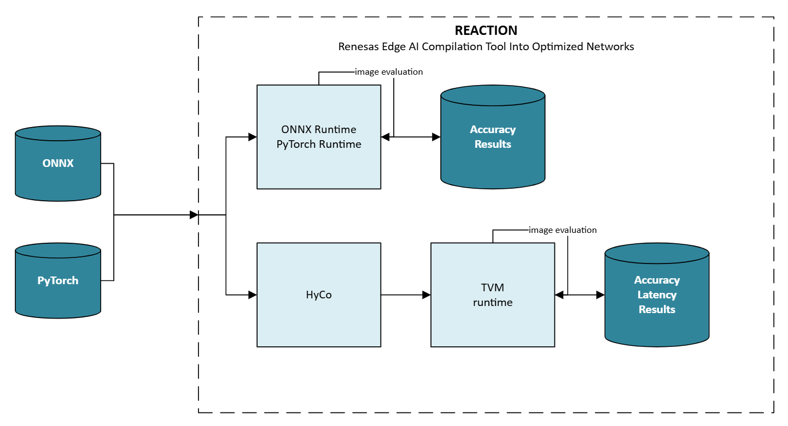

== High Level Architecture

At a high level, the execution flow using REACTION is as follows:

* Input a model into REACTION
* Execute the model through one of the two main data paths
** Default runtime (ONNX Runtime or PyTorch Runtime)
** TVM
* Execute the model for N iterations with different inputs to assess accuracy

[NOTE]
====
The latency is only shown for execution on actual hardware
====

For a more detailed execution flow, see xref:04_detailed_execution_flow.adoc[exhaustive execution types and flow]
