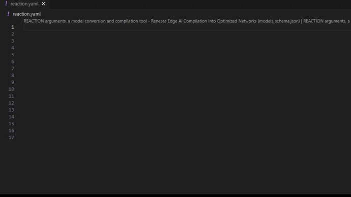

== Tutorials

=== Getting Started Guide

==== Prerequisites

Ensure the following prerequisites are installed on your system:

Basic System requirements

* Python >= 3.10
* Ubuntu >= 20.04
* Docker-compose >= 2.27

Python packages 

* numpy >= 1.22
* pandas >= 1.3.5 
* requests < 2.32.1 
* docker >= 7.0.0 
* pyyaml >= 6.0 
* poetry >= 1.8.3 
* urllib3 >= 1.26.5

please note that all Python packages in the `REACTION Installation` section below will be installed using the command `pip install -e .`. 

[CAUTION]
====
REACTION has been validated only on non-virtualized environments.  
Running Ubuntu in a Virtual Machine or WSL may require additional modifications and may not work properly.
====

==== REACTION Installation

===== [Optional] Installing Python 3.10 and corresponding pip

To use Python 3.10 and the corresponding pip, refer to following steps to build and install Python 3.10 from source:

* Update and install dependencies
[source,bash]
----
apt-get update
apt-get install -y build-essential libssl-dev libffi-dev zlib1g-dev \
libbz2-dev libreadline-dev libsqlite3-dev wget curl llvm \
libncurses5-dev libgdbm-dev liblzma-dev tk-dev
----

* Download Python source code
[source,bash]
----
wget https://www.python.org/ftp/python/3.10.16/Python-3.10.16.tgz
tar -xvf Python-3.10.16.tgz
cd Python-3.10.16
----

* Build and install
[source,bash]
----
./configure --enable-optimizations
make
sudo make altinstall
----

* This setup will automatically configure the pip version required for
Python 3.10. You can confirm the version by running:

[source,bash]
----
pip3 --version
----

===== [Optional] Setup virtual environment

* Install Python venv

[source,bash]
----
python3.10 -m venv .venv
. .venv/bin/activate
pip install -U pip poetry
----

===== Installing from source code

* Install REACTION as a package:

[source,bash]
----
pip3 install -e .
----

[NOTE]
====
Make sure that you are inside REACTION folder for this command to execute correctly.
====

===== Installing from a pre-built wheel file

* [Optional] Build a wheel file:

[source,bash]
----
python3 -m pip wheel --wheel-dir=./build/ --no-deps .
----

This will create a wheel file in the `build` directory, which can be
used for distribution or installation on other systems.

* Install the wheel file using pip:

[source,bash]
----
python3 -m pip install reaction-x.x.x-py3-none-any.whl
----

==== Build Docker Image

===== Export Environment Variables for Docker Compose Build

Before building the Docker images, ensure the following environment
variables are set:

[source,bash]
----
export DATA_DIR="/path/to/data_dir"
export RCAR_XOS_PATH="/path/to/rcar-xos"
----

[NOTE]
====
This guide only covers the process for CPU and CNN-IP. 
For further use cases with VDSP on the SoC, please contact Renesas for more details.
====

===== Docker Image Build

* Build closed REACTION (Docker images for BYOM accuracy/latency
evaluation):

[source,bash]
----
reaction docker build
----

* Build open REACTION (Docker images for open-source model evaluation):

[source,bash]
----
reaction docker build --open
----

[NOTE]
====
By default, the docker images are built only for V4H2. To build docker images for V4M, users should specify the device as V4M.
====

* The common application docker images are not built by default, users must specify the application build using the command below:

[source,bash]
----
reaction docker build --services tvm-app
----

==== Task Configuration (Yaml File Preparation)

===== [Optional] Enable YAML scheme in VS-Code for configs guide

* Go to `File > Preferences > Settings` (assuming YAML extension is
already installed).
* Search for YAML, click Edit in `settings.json`.
* Append the following lines to `settings.json`:

[NOTE]
====
reaction.yaml points to schema inside reaction/configs/*.json.
To enable Yaml schema user must be inside the REACTION folder.
====

[source,json]
----
    "yaml.schemas": {
      "configs/schema.json": "reaction.yaml",
      "configs/models_schema.json": "reaction.yaml"
    }
----

* Enabling the YAML schema will automatically display syntax and structure suggestions, 
and provide model recommendations from the registry. Please note that these suggestions and recommendations are case-sensitive. 
To utilize this feature, it is essential to install the YAML schema extension plugin for the VSCode editor

===== Sample YAML input

Create reaction.yaml file

[source,bash]
----
touch reaction.yaml
----

===== Write configs in reaction.yaml

Write experiment name, experiment model name, task, action (default: go)
and target. Details about the basic items in the experiment can be found in the CLI
chapter:

[source,bash]
----
experiment:
  name: mobilenetv1
  model_name: MobileNet_v1
  task: tvm_cdh
  line: onnx
  action: go
  target: v4h2
  convert_configs:
    tvm:      
      host: <ip address>
      port: <port number>
      user: <account of Board> (optional, default is root)
      passwd: <passwords> (optional, default is NONE)
----

==== Hardware Preparation

When executing neural network models on V4H/V4M boards using TVM RPC, please set up and enable the TVM RPC server as follows.

===== Setting Up TVM RPC Server

Transfer the tvm_rcar_v4h2/v4m_runtime-*.whl Python package provided in
`<HyCo_Release_Package>/sw/tvm_package/build` to the V4H2/V4M board and
install it with pip3. A NumPy update is also needed to run the models
via rpc.

[source,bash]
----
pip3 install --upgrade numpy==1.24.4

pip3 install R_Car_V4x_HyCo_L_TVM_v4h2_runtime-*.whl
----

[NOTE]
====
Updating NumPy requires internet access. Therefore, please ensure that the board has internet connection  before proceeding with the installation of the NumPy package.
====

===== Start TVM RPC server

Before starting a REACTION task on the host machine, launch the RPC server on
V4H2/V4M with this command on the board.

[source,bash]
----
python3 -m tvm.exec.rpc_server --host 0.0.0.0 --port 9090
----

[NOTE]
====
Ensure that the `port` can be used successfully. If the requested port number is occupied, please change it to an available port.
====

==== Quick Start

Define `reaction.yaml` as above and run the following command. 

* Use REACTION CLI (Need to export above environment variables)

[source,bash]
----
reaction start
----

This command serves as the entry point to the entire REACTION repository for inference testing.

By default, the `reaction start` command will search for a `reaction.yaml` file in the current working directory where the command is executed. 
This means that the `reaction.yaml` file should be placed in the same directory from which you run the `reaction start` command for it to be recognized.

* (Optional) Define exported environment variables in `scripts/run_reaction.sh`
run shell script

[source,bash]
----
scripts/run_reaction.sh
----

==== Output Result Verification

Sample `pytorch` task inference output for ResNet50 model.

[source,bash]
----
 ...
08/29 07:09:11 - mmengine - INFO - Epoch(test) [100/100]    accuracy/top1: ***  accuracy/top5: ***  data_time: ***  time: ***
 ...
----

Sample `tvm_cdh` task inference output looks like the image below:

[source,bash]
----
total : n = ***, min = *** ms, max = *** ms, avg = *** ms, std = *** ms
cnnip : n = ***, min = *** ms, max = *** ms, avg = *** ms, std = *** ms
dsp   : n = ***, min = *** ms, max = *** ms, avg = *** ms, std = *** ms
cpu   : n = ***, min = *** ms, max = *** ms, avg = *** ms, std = *** ms
 ...
08/30 00:33:07 - mmengine - INFO - Epoch(test) [100/100]    accuracy/top1: ***  accuracy/top5: ***  data_time: ***  time: ***
 ...
----
