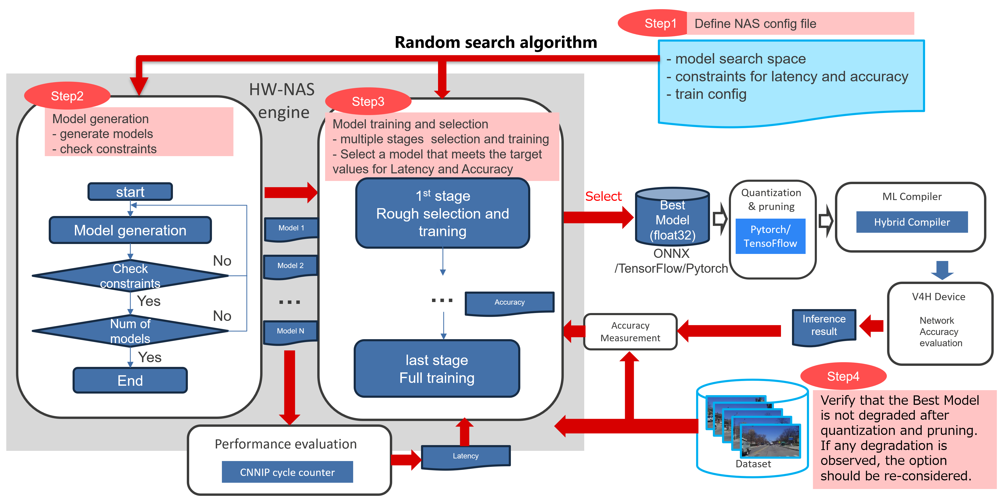

= V4H-NAS

== Overview
V4H-NAS is a tool to search for suitable networks for R-Car V4H. It offers the following features:

- Enable Hardware-aware neural architecture search
- Two methods for R-Car V4H latency estimation:
  * Real-time method -- accurate estimation
  * Table method -- fast estimation with error
- Latency-constrained optimization
  * Finds the best model within the latency constraints, rather than searching for the one that takes into account latency and accuracy
- Easy to parallelize
  * Random search algorithm allows easy parallelization and efficient scaling across multiple GPUs.
- High extensibility
  * Built on https://github.com/open-mmlab[OpenMMLab], making it easy to extend and customize.

V4H-NAS compares accuracy with float32, so it doesn't account for quantization.

== V4H-NAS WorkFlow
V4H-NAS consists of the following four steps. Please refer to the quick start section below for detailed instructions.

Step1：Define NAS configuration file

Step2：Model generation

Step3：Model training and selection

Step4：Verify that the Best Model is not degraded after quantization and pruning

== Supported tasks
V4H-NAS supports following tasks:

- Classification
- Semantic Segmentation
- Object Detection

== Quick start

This section provides a guide to running classification NAS for V4H2 using a pre-configured setup.

Details：link:03_quick_start.adoc[Quick start].
