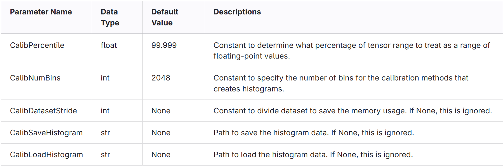
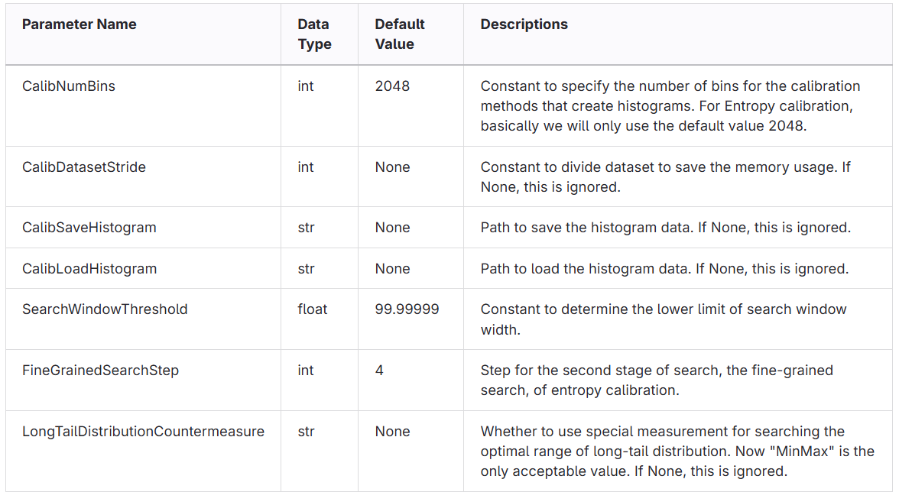

link:../index.adoc[=> Click to go back to index.adoc]

== Selecting the calibration method
The following calibration methods are available, along with their usage instructions.

=== Percentile
Details are given in the <<Enhanced percentile calibration>>.

[source,python]
----
rcar_quantize_static_v4x_tvm(
    ...
    calibrate_method=CalibrationMethod.Percentile,
    ...
)
----

=== MinMax
[source,python]
----
rcar_quantize_static_v4x_tvm(
    ...
    calibrate_method=CalibrationMethod.MinMax,
    ...
)
----

=== Entropy
Details are given in the <<Additional explanation for entropy calibration>> <<Enhanced entropy calibration>>.
[source,python]
----
rcar_quantize_static_v4x_tvm(
    ...
    calibrate_method=CalibrationMethod.Entropy,
    ...
)
----

=== Moving_Average
`CalibMovingAverageConstant` is a constant smoothing factor to use when computing the moving average of the minimum and maximum values. The default is 0.01.
[source,python]
----
rcar_quantize_static_v4x_tvm(
    ...
    calibrate_method=CalibrationMethod.MinMax,
    extra_options={
        "CalibMovingAverage": True,
        "CalibMovingAverageConstant": 0.01
    },
    ...
)
----

== Additional explanation for entropy calibration
In entropy calibration, the algorithm searches for candidate quantization ranges and selects the one with the smallest (best) entropy as optimal range. So, we use the word search window to represent a candidate range within which a search is conducted to find the optimal quantization range. With a histogram that is constructed in the same way as percentile calibration, each candidate can be determined from two dimensions, width (the length of quantization range) and start point (anchor point for a candidate with a specific width).

A problem with our method is that the large number of candidates will cause extremely expensive computational costs to calculate entropy for all the possibilities. Thus a two-step hierarchical search scheme is presented to solve this problem. In the 1st stage, a coarse-grained search is conducted to roughly narrow the range of candidates. In the 2nd stage, a fine-grained search is conducted to carefully search among the limited candidates in the 1st stage. A search step for the 2nd stage is also provided to further accelerate the process. Generally, a smaller search step will search more carefully and will help to find a candidate with lower (better) entropy. However, this cannot ensure better accuracy after the PTQ.

Besides, we found that entropy calibration is not good at dealing with layers that have a long-tail distribution. It tends to return a range as small as possible since a smaller range usually gives a smaller entropy for this kind of distribution. This may cause the calculated quantization range not to be proper and decrease the accuracy. The impact depends on the number and the importance of layers with long-tail distribution. As a solution, a countermeasure LongTailDistributionCountermeasure is provided to reduce the impact of this. Please also note that this measure can be enabled or disabled according to users' will.

== Enhanced percentile calibration
For percentile calibration, some additional parameters can be used as `extra_options`.
Basically, percentile calibration takes a lot of time to get the data range; Using `CalibDatasetStride` option, the calibration dataset is divided to save the RAM usage; with options `CalibSaveHistogram` and `CalibLoadHistogram`, saving and loading of the data range can be performed, allowing an efficient search for percentile values.

== Enhanced entropy calibration
For entropy calibration, some additional parameters can be used as `extra_options`.
Basically, entropy calibration takes a lot of time to get the data range; with option `CalibDatasetStride`, the calibration dataset is divided to save the RAM usage; with options `CalibSaveHistogram` and `CalibLoadHistogram`, saving and loading of the data range can be performed, allowing an efficient search for entropy values.

=== How to reduce memory usage in ONNX Runtime.
`CalibDatasetStride` is constant to specify a stride of the dataset used in one calibration.
When `None` is specified for `CalibDatasetStride`, calibration will be executed without splitting the dataset. It will, however, consume a lot of memory depending on the size of the dataset because ONNX Runtime uses all of the datasets in the data reader at a time. In order to avoid this, please make sure an integer value suitable for your memory size is set to `CalibDatasetStride` to split the dataset during calibration. In this case, you need to implement `__getitem__` and `__len__` to save a split dataset and to obtain the length of all the datasets respectively on the data reader as in the following example.

[source, python]
----
# If you want to execute percentile calibration splitting dataset,
# Set "CalibDatasetStride" and define a DataReader as follows

    class HistogramSimpleDataReader(CalibrationDataReader):
    ...

    def __getitem__(self, indices):
        # define to save split dataset and to return self
        start = indices.start
        stop = indices.stop
        # split dataset
        self.split_enum_data_dicts = iter(self.enum_data_dicts[start:stop])
        return self

    def __len__(self):
        # define to return the length of all dataset
        return self.datasize

    ...

    calib_method = CalibrationMethod.Percentile
    extra_option = {
        "CalibPercentile": 99.999,
        "CalibNumBins": 2048,
        "CalibDatasetStride": 10,
    }
    rcar_quantize_static_v4x_tvm(
        model_input,
        model_output,
        dr,
        per_channel=True,
        global_config=global_config,
        calibrate_method=calib_method,
        extra_options=extra_option,
    )
----

link:../index.adoc[=> Click to go back to index.adoc]
