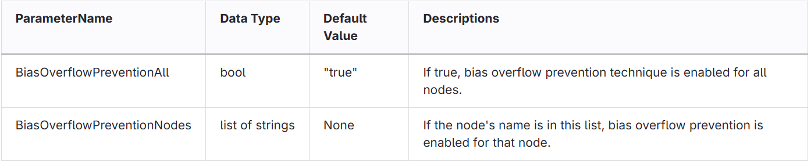

link:../index.adoc[=> Click to go back to index.adoc]

== Quantization Format

Similar to `onnxruntime.quantization.quantize_static`, this method quantizes only `float32` tensors.
Currently, CNNIP requires some constraints in the quantization process for executing the quantized model on the device.

* Inputs & Outputs for Concat layers have the same scales and zero points.
* The input and output scales and zero points of layers to be fused to Convolution and Add must be the same.
** e.g., Upsample, Pool, ReLU/Clip, Sigmoid, Tanh

`rcar-ort-quantizer` generates an ONNX model with the following quantization specifications.

* Activation tensors are quantized in `asymmetric per tensor` format for int8 quantization and `symmetric per tensor` format for int16 quantization.
* Initializers are quantized in `symmetric per tensor` or `symmetric per channel` format.
* `per channel` quantization is supported only for the following tensors
** https://github.com/onnx/onnx/blob/v1.13.1/docs/Operators.md#Conv/[Conv]
*** `W` (axis=0), `B` (axis=0)
** https://github.com/onnx/onnx/blob/v1.13.1/docs/Operators.md#ConvTranspose/[ConvTranspose]
*** `W` (axis=1), `B` (axis=0)
** https://mmcv.readthedocs.io/en/master/deployment/onnxruntime_custom_ops.html#mmcvdeformconv2d[MMCVDeformConv2d]
*** `inputs[2]` (axis=0)
** https://github.com/onnx/onnx/blob/v1.13.1/docs/Operators.md#MatMul/[MatMul]
*** `A`(axis=-2), `B`(axis=-1)
** https://github.com/onnx/onnx/blob/v1.13.1/docs/Operators.md#Gemm/[Gemm]
*** `B`(axis=1), `C`(axis=0)

== Changes from `onnxruntime.quantization.quantize_static`
* ReLU/Clip operators remain on the quantized ONNX file.
* Addition of operations to be quantized
* Some constraints described in `Quantization Format` for CNNIP are reflected after calibration.
* Additional model optimizations are performed before calibration such as:
** fuse `ConvTranspose` + `BatchNormalization` into single `ConvTranspose`
** copy initializers shared by multiple Nodes as an independent initializer.
** remove `Resize` layers that do not change sizes
** optimized model is saved as `<onnx name>_opt.onnx`
* some arguments are removed:
** `quant_format`:  removed since only `QDQ` format is supported
** `per_channel`: removed since only `per_channel=True` is supported
** `optimize_model`: removed since only `optimize_model` is supported

== Bias Overflow Prevention
In the convolution layer, bias is generally quantized to a value of int32.
If the value of weight is very small compared to the value of bias, the quantized bias value may exceed the int32 data range, resulting in accuracy degradation.
This problem can be solved by using a large weight scale value in relation to the weight data range.

[source, python]
----
extra_option = {
    "BiasOverflowPreventionNodes":["Conv_0", "Conv_3"],
    "BiasOverflowPreventionAll": false,
    ...
}
rcar_quantize_static_v4x_tvm(
    model_input,
    model_output,
    ...
    extra_options=extra_option,
)
----

link:../index.adoc[=> Click to go back to index.adoc]
