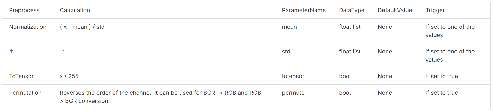

link:../index.adoc[=> Click to go back to index.adoc]

= Getting started: `+rcar-ort-quantizer+` for TVM

== Validation

* Validation tests are performed with the following conditions:
** ONNX model
*** optimized by using `onnxsim==0.4.33`
** arguments
*** default parameters are used for optional arguments
** Only `QDQ` format is tested. `QOperator` is not supported.

== Mixed Precision

=== int16 quantization
* By default, int8 quantization is applied to activation and initializer.
* By specifying an activation name in `extra_options["Int16Activations"]`, the activation can be quantized with int16.
** If input or output of `Conv/ConvTranspose` are specified here, weight initializers are automatically quantized with int16.
+
[source, python]
----
from rcar_ort_quantizer.rcar_quantize_static import rcar_quantize_static_v4x_tvm
rcar_quantize_static_v4x_tvm("/path/to/fp32.onnx", "/path/to/quant.onnx", ..., extra_options={"Int16Activations":["tensor_name_0", "tensor_name_1"], })
----

* Delete the Quantize layer immediately after input.
** By inputting [-32768, 32767] image input data as int16 data, the quantization process immediately after the input layer that existed in the past is skipped.
** This quantization process is handled by the DSP. This option removes it for latency improvement.
+    
[source, python]
----
from rcar_ort_quantizer.rcar_quantize_static import rcar_quantize_static_v4x_tvm
rcar_quantize_static_v4x_tvm("/path/to/fp32.onnx", "/path/to/quant.onnx", ..., extra_options={"raw_image_input_layer_names": {"int16": ["tensor_name_0"]}, "Int16Activations":["tensor_name_0"], })
----

=== float32
* If you want to keep some operators `float32`, please specify nodes' names in `node_to_exclude` parameters
** `nodes_to_quantize` is not tested, so it is not recommended
* For example, if you want to calculate two nodes whose names are `node_name_0` and `node_name_1` in `float32`, you can create a QDQ ONNX model like this:
+    
[source, python]
----
from rcar_ort_quantizer.rcar_quantize_static import rcar_quantize_static_v4x_tvm
rcar_quantize_static_v4x_tvm("/path/to/fp32.onnx", "/path/to/quant.onnx", ..., nodes_to_exclude=["node_name_0", "node_name_1"], ...)
----

=== uint8
[[uint8-id]]
* Limited support is available for the uint8 format.
** Support only the input of "Conv" in the case where there is a "Conv" immediately after the input.
** Image input with [0-255] range.
* For example, to specify an input layer named `input_name_0` with `uint8` data type, use the following options:
+
[source, python]
----
from rcar_ort_quantizer.rcar_quantize_static import rcar_quantize_static_v4x_tvm
rcar_quantize_static_v4x_tvm("/path/to/fp32.onnx", "/path/to/quant.onnx", ..., extra_options={"raw_image_input_layer_names": {"uint8": ["input_name_0"]}}, ...)
----

* Delete the Quantize layer immediately after input.
** By inputting [0-255] image input data as uint8 (scale=1., zp=0) data, the quantization process immediately after the input layer that existed in the past is skipped.
** Conventionally, this quantization process is handled by the DSP. This option removes it.

Below is an image of the generated QDQ model.

```mermaid
graph LR;
    A([Input]) -- uint8 --> B[Dequantize <br> scale=1, zp=0];
    subgraph CNNIP
    B --> D[Conv];
    D --> E[Quantize];
    end
    E -- int8 --> F[...];
```


If no options are specified, the following QDQ model is usually generated.
```mermaid
graph LR;
    A([Input]) -- float32 --> B[Quantize];
    subgraph DSP
    B;
    end
    subgraph CNNIP
    B -- int8 --> C[Dequantize];
    C --> D[Conv];
    D --> E[Quantize];
    end
    E -- int8 --> F[...];
```


== Insertion of preprocessing included Convolution to perform preprocessing in CNNIP

* This option allows CNNIP to perform pre-processing.
* Specifically, a conv layer for preprocessing is inserted at the beginning of the ONNX model.
* This option assumes that uint8 format is specified for the preprocessing conv. Therefore, the uint8 option is automatically set when this option is enabled.
For more information on uint8 format, please refer to the <<uint8-id, uint8 section>>.

The names of the preprocessing and parameters that can be specified are as follows. 



* For example, specify as follows.
** Specify `InsertPreprocess` option in *dictionary* form.
** Specify the type of preprocessing and its value in the dictionary. The Conv layer with the specified preprocessing will be included.
** All processes can be specified or individually.
** Whether there is one input or multiple inputs, processing is performed on all inputs.

```py
rcar_quantize_static_v4x_tvm(
    "/path/to/fp32.onnx",
    "/path/to/quant.onnx",
    ...,
    extra_options={
        "InsertPreprocess": {
            "mean": [123.675, 116.28, 103.53],
            "std": [58.395, 57.12, 57.375],
            "totensor": True,
            "permute": True
        },
        ...
    }
)
```

* If you want to change the designation for each input layer
** Specify InsertPreprocess as an array.
** Conv will be inserted at the point of the input specified by node_name.

```py
rcar_quantize_static_v4x_tvm(
    "/path/to/fp32.onnx",
    "/path/to/quant.onnx",
    ...,
    extra_options={
        "InsertPreprocess": [
            {
                "node_name": "x",
                "mean": [0.485, 0.456, 0.406],
                "std": [0.229, 0.224, 0.225],
                "totensor" : True,
                "permute" : True
            },
            {
                "node_name": "y",
                "mean": [0.485, 0.456, 0.406],
                "std": [0.229, 0.224, 0.225],
                "totensor" : True,
                "permute" : True
            }
        ],
        ...
    }
)
```

* Support is also provided for the inserted Conv with uint8 input and int16 output when the activation type is int16.
```py
rcar_quantize_static_v4x_tvm(
    "/path/to/fp32.onnx",
    "/path/to/quant.onnx",
    activation_type=QuantType.from_string("QInt16"),
    weight_type=QuantType.from_string("QInt16"),
    ...,
    extra_options={
        "InsertPreprocess": {
            "totensor": True,
        },
        ...
    }
)
```

=== Generated ONNX images
Below is the original float ONNX. ONNX with the Conv layer as input is used as an example.
```mermaid
graph LR;
    A([Input]) --> B[Conv];
    B --> C[...];
```

This option inserts a conv layer with preprocessing at the beginning of float ONNX.
```mermaid
graph LR;
    A([Input]) --> B[PreproConv];
    B --> C[Conv];
    C --> D[...];
```

The uint8 option is automatically specified, and the following QDQ ONNX is generated after quantization.
```mermaid
graph LR;
    A([Input]) -- uint8 --> B[Dequantize];
    subgraph Preprocessed Conv:CNNIP
    B --> C[PreproConv];
    C --> D[Quantize];
    end
    subgraph Original Conv:CNNIP
    D -- int8 --> E[Dequantize];
    E --> F[Conv];
    F --> G[Quantize];
    end
    G -- int8 --> H[...];
```

If the activation type is int16, the following QDQ ONNX is generated after quantization.

```mermaid
graph LR;
    A([Input]) -- uint8 --> B[Dequantize];
    subgraph Preprocessed Conv:CNNIP
    B --> C[PreproConv];
    C --> D[Quantize];
    end
    subgraph Original Conv:CNNIP
    D -- int16 --> E[Dequantize];
    E --> F[Conv];
    F --> G[Quantize];
    end
    G -- int16 --> H[...];
```

== When using MMCVDeformConv2d

Because `MMCVDeformConv2d` is not defined at https://github.com/onnx/onnx/blob/v1.13.1/docs/Operators.md, following steps are required.

* The `MMCVDeformConv layer` in the ONNX file must have `domain="mmdeploy"` set.
* Call rcar_quantize_static_v4x_tvm with `extra_options` as below:
** `libmmdeploy_onnxruntime_ops_ubuntu2004.so` can be found in `rcar-ort-quantizer/lib/`.
** Only `libmmdeploy_onnxruntime_ops_ubuntu2004.so` must be specified as an argument, but all `.so` files in `rcar-ort-quantizer/lib/` are necessary.

[source,python]
----
rcar_quantize_static_v4x_tvm(
    "/path/to/fp32.onnx",
    "/path/to/quant.onnx",
    calibration_datareader,
    extra_options={"custom_operator_lib": "/path/to/libmmdeploy_onnxruntime_ops_ubuntu2004.so"},
    ...
)
----

link:../index.adoc[=> Click to go back to index.adoc]
