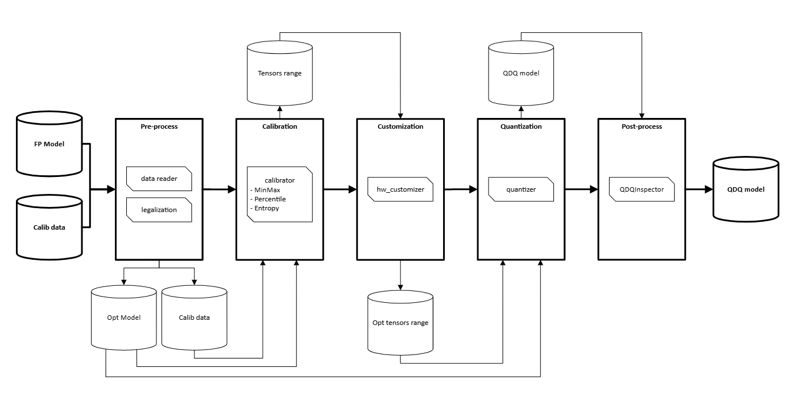

= R-Car ORT Quantizer overview

The `rcar-ort-quantizer` provides a core API called `rcar_quantize_static` which serves as a drop-in replacement for `onnxruntime.quantization.quantize_static`.

So, you can simply replace the existing `quantize_static` call with the `rcar_quantize_static` like below.

[source, diff]
----
-from onnxruntime.quantization import quantize_static
+from rcar_ort_quantizer.rcar_quantize_static import rcar_quantize_static_v4x_tvm

-quantize_static("/path/to/fp32.onnx", "/path/to/quant.onnx", ...)
+rcar_quantize_static_v4x_tvm("/path/to/fp32.onnx", "/path/to/quant.onnx", ...)  # for tvm
----

The following flowchart shows how R-Car ORT Quantizer works.

= R-Car ORT Quantizer workflow and key functions & options

The workflow of R-Car ORT Quantizer can be divided into the following five stages.

== I. Preprocess

=== DataReader

* The data reader is responsible for reading the data needed, converting it to the appropriate format, and feeding it into the network.
* Users must create each DataReader themselves according to their use case. If you need Pre-processing, it must also be implemented within the DataReader.
* Examples of DataReader creation and pre-processing are at this https://github.com/microsoft/onnxruntime-inference-examples/blob/main/quantization/image_classification/cpu/resnet50_data_reader.py[link].

=== Legalization

* The legalizations are modifying the model structure through techniques such as fusing, removing, and replacing some nodes. Basically, this will help to improve the performance of the given model.
* We recommend that users simplify their model before applying our legalization and quantization by using ONNX Simplifier (onnxsim) since it also does some legalization.
* The legalizations are defined in `OrtQuantizer.preprocess()`. For details about supported legalizations, see link:01_preprocess/preprocess.adoc#legalization-functions[Legalization functions].

== II. Calibration

* In this stage, we will calculate the tensor ranges for each layer to quantize. These tensor ranges will be used as the inputs for PTQ quantization stage.
* Currently, available calibration methods are minmax, percentile, and entropy. 
* Processes related to calibration are defined in `OrtQuantizer.calibrator()`. For details about the calibration methods, see link:02_calibration/calibration.adoc[calibration.adoc].

== III. Customization

* When the target HW is V4H2, it is required to do some customized modifications on the tensors_range (output of calibration) based on the HW specification.
* The customizer is defined in `OrtQuantizer.hw_customizer()`. For details about the customization, see link:03_customization/customization.adoc[customization.adoc].

== IV. Quantization

* PTQ quantization will be performed at this stage. The quantizer is based on onnxruntime quantizer and has been implemented with additional functionalities.
* The quantizer is defined in `OrtQuantizer.quantizer()`. For details about quantization, see link:04_quantization/quantization.adoc[quantization.adoc].

== V. Post-process

=== QDQ Inspector

* The inspector is used to check if the generated QDQ model is legal or not. By applying `QDQInspector.inspect()` on given models, nodes of the QDQ model will be checked according to the op_type.

== VI. Other key functions

=== Extra_Options

* Extra options are provided for more flexible behavior control.
* For details about available extra_options, see link:05_extra_options/extra_options.adoc[extra_options.adoc].

=== R-Car ORT Quantizer for TVM

* `rcar-ort-quantizer` is also specially optimized for TVM.
* Details are given in link:06_rcar_ort_quantizer_for_tvm/rcar_ort_quantizer_for_tvm.adoc[rcar_ort_quantizer_for_tvm.adoc].
