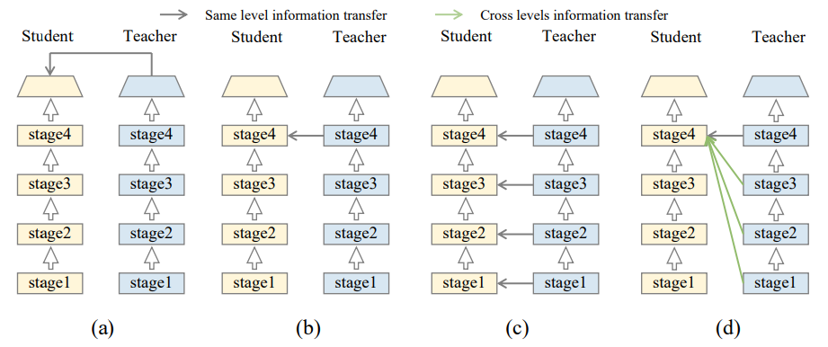

== RCAR QAT Quantizer

=== 1 Overview

RCar QAT Quantizer is a wrapper for PyTorch<<pytorch>> to quantize PyTorch models in an executable format in RCar V4x.
The following features are added to RCar QAT Quantization:

* Addition of operations to be quantized
* Reflection of quantization constraints for execution with RCar V4X
* Generation of input files to the TVM

==== 1.1 Workflow

=== 2 Installation

==== 2.1 Build and install with docker image

* Open your terminal.
* Navigate to the directory containing `set_env.sh` script.
* Import environment variables defined in `set_env.sh`. Note that check the definition of variables before sourcing and modify them if necessary.

[source, bash]
----
source set_env.sh
----

* Run the following script to build docker image.

[source, bash]
----
./docker/dockerbuild.sh
----

* Run the following script to launch a Docker container.

[source, bash]
----
./scripts/docker_run_qat.sh
----

==== 2.2 Install with whl

===== Prerequisites

RCar QAT is based on PyTorch FX solution<<fx>> for quantization. It is recommended to use GPU for the QAT finetuning with the following dependency:

* Python3.8 or higher
* PyTorch >= 2.1.2

===== Install whl package

Install RCar QAT with the following command:

[source, bash]
----
pip install R_Car_V4x_HyCo_L_PyTorch_Quantizer-*.whl
----

=== 3. Quick Start

RCar QAT leverages PyTorch FX mode to do the QAT. Users can follow the flow below to conduct RCar QAT.

==== 3.1 Prepare QAT configuration and RCAR Backendconfig

PyTorch FX mode requires users to set `QconfigMapping` before preparing the QAT model. RCar QAT Quantizer uses the following API to set it for user convenience. Currently, only INT8 quantization is supported.

[source, python]
----
from rcar_qat_quantizer.rcar_qconfig_mapping import get_rcar_v4h2_qconfig_mapping
----

The `BackendConfig` is needed to meet the V4X operators requirement. Users can control how QDQ is inserted via `BackendConfig` and specify the fusion pattern which will be further discussed in Chapter Fusion Pattern.

RCar QAT Quantizer provides the following API to get `BackendConfig` for V4X.

[source, python]
----
from rcar_qat_quantizer.rcar_backend_config import get_rcar_v4h2_backend_config
----

==== 3.2 Prepare QAT model

PyTorch uses `prepare_qat_fx` before QAT to insert fakequant and observer automatically. RCar QAT Quantizer uses `rcar_prepare_qat_fx` to replace the original PyTorch API with extended functionality.

[source, python]
----
from rcar_qat_quantizer.rcar_prepare_fx import rcar_prepare_qat_fx
----

==== 3.3 Calibration/Training

The previous step already inserted observers into the model. The next step is to run the model for calibration/training to analyze data distribution and determine the quantization parameters. Users can define calibration/training functions or leverage the AutoTune tool provided by RCar QAT Quantizer. It will be introduced in detail later.

==== 3.4 Convert QDQ model

After calibration/training, PyTorch uses `convert_fx` to convert the model to a QDQ reference model and lower it to the PyTorch Native Backend. RCar QAT Quantizer defines `rcar_convert_fx` to convert the model and lower it according to V4X. This is because PyTorch Native Backend converts the QDQ model into quantized modules which may introduce limitations in datatype and operators. For example, PyTorch recognizes `dequantize - aten::relu - quantize` and replaces it with `quantized::relu`, which only supports the `uint8` datatype. The `rcar_convert_fx` still keeps the QDQ operators and doesn't convert them into PyTorch Native Backend.

[source, python]
----
from rcar_qat_quantizer.rcar_convert_fx import rcar_convert_fx
----

==== 3.5 Save quantized model

RCar QAT Quantizer uses `TorchScript`<<jit>> to save and load quantized models. Below is an example to save a quantized model:

[source, python]
----
quantized_model = rcar_convert_fx(
    qat_model,
    qconfig_mapping=qconfig_mapping,
    backend_config=backend_config,
)
quantized_model.eval()
# save torchscript
torch.jit.trace(quantized_model, example_inputs).save(model_to_save_name)
----

=== 4 Instructions

==== 4.1 Fusion Pattern

RCar QAT Quantizer defines the fusion pattern in `rcar_backend_config.py`. The supported fusion patterns are shown below:

[cols="1", options="header"]
|===
|Pattern
|Conv+BN
|Conv+LeakyReLU
|Conv+ReLU6
|nn.Conv2d+nn.Sigmoid
|nn.Conv2d+torch.Tensor.sigmoid
|nn.Conv2d+torch.sigmoid
|nn.Conv2d+torch.Tensor.sigmoid_
|nn.Conv2d+torch.sigmoid_
|nn.Conv2d+F.sigmoid
|nn.Conv2d+nn.Sigmoid
|nn.Conv2d+nn.ReLU
|nn.Conv2d+F.relu
|nn.Conv2d+nn.BatchNorm2d
|nn.Conv2d+F.bath_norm2d
|nn.Conv2d+nn.BatchNorm2d+nn.ReLU
|nn.Conv2d+nn.BatchNorm2d+F.relu
|nn.Conv2d+F.bath_norm2d+nn.ReLU
|nn.Conv2d+F.bath_norm2d+F.relu
|F.conv2d+nn.Sigmoid
|F.conv2d+nn.ReLU
|F.conv2d+F.relu
|F.conv2d+nn.BatchNorm2d
|F.conv2d+F.bath_norm2d
|F.conv2d+nn.BatchNorm2d+nn.ReLU
|F.conv2d+nn.BatchNorm2d+F.relu
|F.conv2d+F.bath_norm2d+nn.ReLU
|F.conv2d+F.bath_norm2d+F.relu
|F.conv2d+F.sigmoid
|Add+ReLU
|nn.ConvTranspose2d+nn.ReLU
|nn.ConvTranspose2d+nn.Sigmoid
|nn.ConvTranspose2d+torch.Tensor.sigmoid
|nn.ConvTranspose2d+torch.sigmoid
|nn.ConvTranspose2d+torch.Tensor.sigmoid_
|nn.ConvTranspose2d+torch.sigmoid_
|nn.ConvTranspose2d+F.sigmoid
|nn.ConvTranspose2d+F.relu
|nn.ConvTranspose2d+nn.BatchNorm2d
|nn.ConvTranspose2d+F.bath_norm2d
|nn.ConvTranspose2d+nn.BatchNorm2d+nn.ReLU
|nn.ConvTranspose2d+nn.BatchNorm2d+F.relu
|nn.ConvTranspose2d+F.bath_norm2d+nn.ReLU
|nn.ConvTranspose2d+F.bath_norm2d+F.relu
|F.conv_transpose2d+nn.Sigmoid
|F.conv_transpose2d+nn.ReLU
|F.conv_transpose2d+F.relu
|F.conv_transpose2d+nn.BatchNorm2d
|F.conv_transpose2d+F.bath_norm2d
|F.conv_transpose2d+nn.BatchNorm2d+nn.ReLU
|F.conv_transpose2d+nn.BatchNorm2d+F.relu
|F.conv_transpose2d+F.bath_norm2d+nn.ReLU
|F.conv_transpose2d+F.bath_norm2d+F.relu
|torch.add+nn.ReLU
|torch.add+F.relu
|operator.add+nn.ReLU
|operator.add+F.relu
|torch.Tensor.add+nn.ReLU
|torch.Tensor.add+F.relu
|torch.Tensor.add_+nn.ReLU
|torch.Tensor.add_+F.relu
|===

==== 4.2 TVM execution

TVM supports parsing the TorchScript model into TVM Relay. Below is an example to convert a TorchScript model into TVM Relay:

[source, python]
----
import torch
from tvm import relay
example_inputs = (torch.randn(batch_size, 3, 224, 224),)
input_name = "input0"
shape_list = [(input_name, example_inputs[0].shape)]
scripted_module = torch.jit.load(script_model_path)
mod, params = relay.frontend.from_pytorch(
    scripted_module, shape_list, keep_quantized_weight=False
)
----

Please find the TVM User Manual for more details.

==== 4.3 Auto-tune by Hyperband

RCar QAT Quantizer provides the API to make use of Hyperband<<hyperband>> for automatic hyperparameter searching. It combines the ideas of random search and grid search, while taking resource costs into account.

Please find more details in chapter Utility.

==== 4.4 SNR Analyze tool

The SNR Analyze tool is developed based on PyTorch numeric suite<<numeric>>, and can analyze the differences between a floating-point (FP32) model and its quantized version. It provides detailed statistics and visualizations to help developers understand the impact of quantization on model weights and activations.

Please find more details in chapter Utility.

==== 4.5 Legalization

To improve accuracy, inference performance, and backend compatibility, RCar QAT Quantizer provides the legalization module. Most legalization processes are enabled by default. Users can also import a single legalization and run it by themselves:

[source, python]
----
from rcar_qat_quantizer.passes import remove_identity
optimized_fx_module = remove_identity(fx_module)
----

The available legalization are listed as below:

* Legalization Passes for QAT

[cols=4*, options="header"]
|===
|Pass                        |Enable option                                             |Stage                 |Function
|decompose_maxpool           |Enable by `decompose_maxpool=True` in `rcar_prepare_fx`   |after symbolic_trace  |decompose big kernel MaxPool2D to multiple 3x3 MaxPool2D(Optional)
|remove_identity             |Enabled by default                                        |after symbolic_trace  |Remove identity operations in graph module
|fold_add_zero               |Enabled by default                                        |after symbolic_trace  |Fold the operator `torch.add/operator.add/add` with 0 as addend or summand in graph module
|unify_tensor_input_arithmetic|Enabled by default                                       |after symbolic_trace  |Unify tensor input for arithmetic operators in graph module
|unify_squeeze_dim           |Enabled by default                                        |after symbolic_trace  |Unify squeeze dim: int or tuple of ints -> tuple of ints
|fold_zero_like              |Enabled by default                                        |after symbolic_trace  |Fold `torch.zero_like` operations in graph module
|unify_batch_norm            |Enabled by default                                        |after symbolic_trace  |Unify batch norm in graph module
|unify_conv_transpose2d_conv2d|Enabled by default                                       |after symbolic_trace  |Replace `F.conv_transpose2d` with `nn.ConvTranspose2d` and replace `F.conv2d` with `nn.Conv2d`in graph module
|replace_linear_with_conv    |Enabled by default                                        |after symbolic_trace  |Replace `flatten/reshape/view+[dropout]+linear` with `[dropout]+conv1x1+reshape` to run on CNNIP
|replace_mul_with_conv       |Enabled by default                                        |after symbolic_trace  |Replace mul with the depthwise and pointwise conv2d to run on CNNIP
|eliminate_observer          |Enabled by default                                        |after rcar_prepare_fx |Remove the QDQ for input and output which will not do quantization
|align_concat_input_scale_zp |Enabled by default                                        |after rcar_prepare_fx |align input scale/zp for concat
|quant_norm_weights          |Enabled by default                                        |after rcar_prepare_fx |add observer/fakequantize to weight&bias for layer_norm, group_norm, instance_norm
|lower_to_rcar_ref_module    |Enabled by default                                        |after rcar_convert_fx |lower to rcar reference module to support quantization for operators: layer_norm, group_norm, instance_norm
|replace_view_with_reshape   |Enabled by default                                        |after rcar_convert_fx |replace view with reshape
|remove_dropout              |Enabled by default                                        |after rcar_convert_fx |Remove dropout operations in graph module for evaluation
|remove_loss                 |Enabled by default                                        |after rcar_convert_fx |Remove loss operations in graph module, which are not needed during evaluation
|remove_contiguous           |Enabled by default                                        |after rcar_convert_fx |Remove contiguous operations in graph module, which are not needed for RCAR
|check_bias_overflow         |Enable by `check_bias_overflow=True` in `rcar_convert_fx` |after rcar_convert_fx |Check bias flow and update the weight scale accordingly for Conv
|unify_clamp                 |Enabled by default                                        |after rcar_convert_fx |(i) `torch.clamp_min` and `torch.clamp_max` are unified as `torch.clamp` (ii) missing `(min, max)` -> are initialized with values according to its input's dtype
|===

* Legalization Passes for PTQ

[cols=4*, options="header"]
|===
|Pass                        |Enable option                                             |Stage                 |Function
|decompose_maxpool           |Enable by `decompose_maxpool=True` in `rcar_prepare_fx`   |after symbolic_trace  |decompose big kernel MaxPool2D to multiple 3x3 MaxPool2D(Optional)
|remove_identity             |Enabled by default                                        |after symbolic_trace  |Remove identity operations in graph module
|remove_dropout              |Enabled by default                                        |after symbolic_trace  |Remove dropout operations in graph module for evaluation
|remove_loss                 |Enabled by default                                        |after symbolic_trace  |Remove loss operations in graph module, which are not needed during evaluation
|fold_add_zero               |Enabled by default                                        |after symbolic_trace  |Fold the operator `torch.add/operator.add/add` with 0 as addend or summand in graph module
|unify_squeeze_dim           |Enabled by default                                        |after symbolic_trace  |Unify squeeze dim: int or tuple of ints -> tuple of ints
|fold_zero_like              |Enabled by default                                        |after symbolic_trace  |Fold `torch.zero_like` operations in graph module
|unify_batch_norm            |Enabled by default                                        |after symbolic_trace  |Unify batch norm in graph module
|unify_conv_transpose2d      |Enabled by default                                        |after symbolic_trace  |Replace `F.conv_transpose2d` with `nn.ConvTranspose2d` in graph module
|replace_linear_with_conv    |Enabled by default                                        |after symbolic_trace  |Replace `flatten/reshape/view+[dropout]+linear` with `(dropout+)conv1x1+reshape` to run on CNNIP
|replace_mul_with_conv       |Enabled by default                                        |after symbolic_trace  |Replace mul with the depthwise and pointwise conv2d to run on CNNIP
|eliminate_observer          |Enabled by default                                        |after rcar_prepare_fx |Remove the QDQ for input and output which will not do quantization
|align_concat_input_scale_zp |Enabled by default                                        |after rcar_prepare_fx |align input scale/zp for concat
|quant_norm_weights          |Enabled by default                                        |after rcar_prepare_fx |add observer/fakequantize to weight&bias for layer_norm, group_norm, instance_norm
|lower_to_rcar_ref_module    |Enabled by default                                        |after rcar_convert_fx |lower to rcar reference module to support quantization for operators: layer_norm, group_norm, instance_norm
|replace_view_with_reshape   |Enabled by default                                        |after rcar_convert_fx |replace view with reshape
|remove_contiguous           |Enabled by default                                        |after rcar_convert_fx |Remove contiguous operations in graph module, which are not needed for RCAR
|check_bias_overflow         |Enable by `check_bias_overflow=True` in `rcar_convert_fx` |after rcar_convert_fx |Check bias flow and update the weight scale accordingly for Conv
|unify_clamp                 |Enabled by default                                        |after rcar_convert_fx |(i) `torch.clamp_min` and `torch.clamp_max` are unified as `torch.clamp` (ii) missing `(min, max)` -> are initialized with values according to its input's dtype
|===

=== 5 QAT best practice

==== 5.1 Configurable settings

===== Calibration

* Calibrating before QAT will help initialize the model's quantization parameters with proper values. This is not required but in general, it increases the accuracy (although slightly) and make the loss curve converge faster. Our experiment gives the following results (grey: without calibration vs blue: with calibration).

===== Early stopping

* Early stopping is an important technique in QAT to save training time and resources. If the monitored metric (e.g., training loss or validation accuracy) is not improved in several epochs, the training process will be stopped.
* Generally, all the epochs after the 1st epoch will improve the accuracy by 1-3 points in total. Thus if the 1st epoch gives inadequate accuracy, the QAT process can be considered unsuccessful. Then we can stop the QAT and debug it.

===== Freezing

* Set the timing (after how many epochs) for freezing quantizer params (zero point and scale) by applying `torch.ao.quantization.disable_observer`.
* Set the timing (after how many epochs) for freezing batch norm mean and variance estimates by applying `torch.nn.intrinsic.qat.freeze_bn_stats`.
* In certain scenarios, including those involving trainable constants such as `nn.Parameter`, the weights/parameters are trainable during the pre-training phase but should remain constant during QAT fine-tuning. By applying the function below, the weights/parameters will not be updated during QAT fine-tuning, thereby preventing accuracy degradation.

[source, python]
----
# Before applying the Pytorch quantizer API, the user uses the function below to freeze the parameters of the specific submodule.
def dfs_freeze(module):
    for name, child in module.named_children():
        for param in child.parameters():
            param.requires_grad = False
        dfs_freeze(child)
dfs_freeze(self.submodule)
----

===== Loss function

* QAT is essentially a type of fine-tuning, and the purpose is "to minimize the loss of accuracy from quantization on real models". Generally, ground truth (label) is the most common training target. Besides, knowledge distillation is also a technique that can be combined with QAT. In this case, the teacher can be the FP model output or all the intermediate layer's output (our implementation). An image on previous knowledge distillation was given in the paper "Distilling Knowledge via Knowledge Review<<distil>>".

* Design customized loss function:
** Loss between `quant_model(img)` and ground truth.
** Loss between `quant_model(img)` and `f32_model(img)`, inspired by Knowledge Distillation.
** Loss between all the intermediate outputs of `quant_model` and `f32_model`.
*** This is the implemented loss function and we found this method usually performs better than others.
** A mixture loss of `(1-lambda)*CE_loss + lambda*KD_loss` is verified to be not efficient, and solely minimizing KL-Loss (Kullback-Leibler divergence loss between the teachers and students' penultimate outputs) is sufficient to achieve optimal gradient updates in the quantized network<<kl>>.

* Compare the final accuracy with different loss functions (test with mobilenetv3):

** Yellow: `f32_model(img)` as target
** Grey: Ground truth as target
** Black: Intermediate outputs as target

==== 5.2 Hyperparameter

* Epoch:
** Fine-tune for around 10% of the original training epochs.

* Optimizer:
** Recommend using the same optimizer as the one used for training the float model, and try SGD if there are any problems.
** Recommend enabling weight decay:
*** Weight decay is a method that consists of adding a regularization term to the loss function to penalize large values of the weights. This is an effective method for avoiding over-fitting (can be combined with early stopping) and for reducing the complexity of the model. Users can determine which parameters to apply weight decay<<decay>>. Disabling weight decay for some parameters may lift the accuracy slightly, but there may be a side effect at the same time. Users should be careful with the parameters to be applied with weight decay. Generally, applying this method to all the parameters is a safe choice.

* LR:
** If using SGD as an optimizer, test with an initial value of `0.001` and enable `StepLR` to execute LR decay twice with `scale=0.1`.
** If using RMSprop, no need to set `StepLR` since it will update LR automatically.

* Other configurable parameters:
** Keep the same settings as the original training.

[bibliography]
== References

* [[[pytorch, 1]]] https://pytorch.org/docs/stable/quantization.html[Quantization]

* [[[fx, 2]]] https://pytorch.org/tutorials/prototype/fx_graph_mode_quant_guide.html[FX Graph Mode Quantization User Guide]

* [[[jit, 3]]] https://pytorch.org/docs/stable/jit.html[TorchScript]

* [[[hyperband, 4]]] https://arxiv.org/pdf/1603.06560[Hyperband: A Novel Bandit-Based Approach to Hyperparameter Optimization]

* [[[numeric, 5]]] https://pytorch.org/tutorials/prototype/numeric_suite_tutorial.html[PyTorch Numeric Suite Tutorial]

* [[[distil, 6]]] https://arxiv.org/pdf/2104.09044[Distilling Knowledge via Knowledge Review]

* [[[kl, 7]]] https://arxiv.org/pdf/2403.11106[Self-Supervised Quantization-Aware Knowledge Distillation]

* [[[decay, 8]]] https://pytorch.org/docs/stable/optim.html#per-parameter-options[Per-parameter options]
