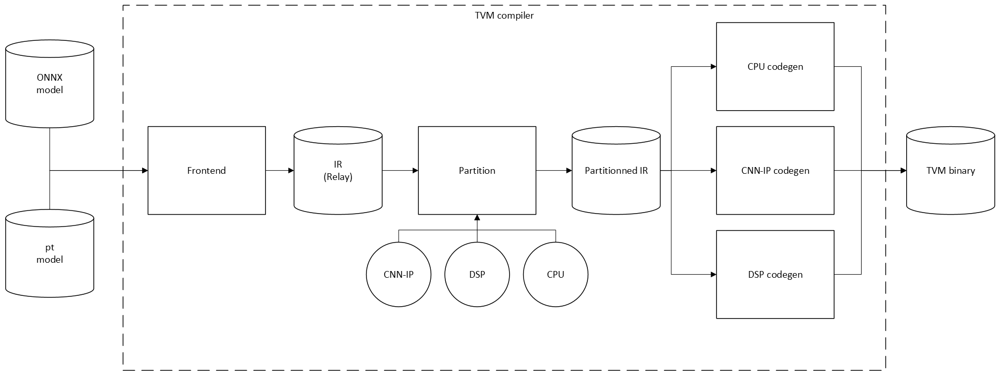

= TVM for R-Car

TVM is a compiler stack for deep learning systems. Refer to https://github.com/apache/tvm for an overview.

The R-Car Hybrid Compiler has been implemented using the Bring Your Own Codegen (BYOC) approach of TVM. The major steps in compiling a model are illustrated in the diagram below:

In code:

[source,python]
----
onnx_model = onnx.load("model.onnx")

# Bind parameters, see "Applying Relay Passes" for explanation
mod["main"] = relay.build_module.bind_params_by_name(mod["main"], params)

# Frontend, import the ONNX model into TVM IR (Relay)
mod, params = relay.frontend.from_onnx(onnx_model)

with tvm.transform.PassContext(opt_level=3):
    # Legalize pre-FQ2I structure, see "Applying Relay Passes" for explanation
    mod = legalize_qdq_for_rcar_imp(mod)

    # This is necessary for the partitioning step, as described in the codegen backend documents
    mod = relay.transform.FakeQuantizationToInteger()(mod)

    # Partition, marking regions of the graph to be offloaded to a custom IP
    mod = partition_for_rcar_imp(mod)
    mod = partition_for_rcardkl(mod)

    # Invoke the codegen(s) to compile the graph into a deployable binary
    llvm = tvm.target.Target("llvm -keys=arm_cpu -mtriple=aarch64-linux-gnu -mattr=+neon")
    lib = relay.build(mod, target=llvm)

    # Serialize for deployment
    lib.export_library("net.tar")
----

For more information about this BYOC approach, as well as general information about how TVM codegen works, please refer to:

* https://tvm.apache.org/2020/07/15/how-to-bring-your-own-codegen-to-tvm
* https://tvm.apache.org/docs/v0.10.0/dev/how_to/relay_bring_your_own_codegen.html
* https://tvm.apache.org/docs/v0.10.0/reference/langref/relay_pattern.html

The following documents go into more detail on the codegen backends in R-Car Hybrid Compiler, and on the runtime.

* xref:02_dkl-codegen.adoc[DKL Codegen Backend]
* xref:03_cnnip-codegen.adoc[R-Car IMP Codegen Backend]
* xref:04_apply-relay-passes.adoc[Applying Relay Passes]
* xref:05_runtime-architecture.adoc[Runtime Architecture]
* xref:Optimizations/index.adoc[Optimizations]
** xref:Optimizations/codegen-optimizations.adoc[DKL Codegen Optimizations]
** xref:Optimizations/misc-optimizations.adoc[Miscellaneous Optimizations]
** xref:Optimizations/wakeup-sleep.adoc[Reducing runtime overhead through WUP/SLP]
