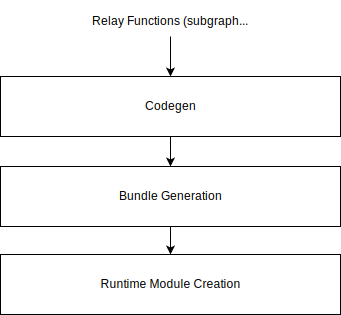

:figure-caption!:

= TVM R-Car IMP Codegen Backend Architecture

This document describes how the CNN-IP backend lowers Relay graphs to command lists (CLs). It works in collaboration with the custom xref:05_runtime-architecture.adoc[`RCarV4XRuntime`] module to produce binaries that it can execute. The backend is implemented as a Function-at-a-time external codegen, where a single partitioned subgraph is passed at a time. A brief explanation about this can be found in link:https://github.com/apache/tvm/blob/513c2be0c3b853a3b77de729f0ea75d448ee3c37/src/relay/backend/te_compiler.cc#L63[relay/backend/te_compiler.cc#L63].

== Architecture Summary

The source code of the TVM codegen backend for R-Car IMP is located under the `python/tvm/relay/op/contrib/rcar_imp/` and `src/relay/backend/contrib/rcar_imp/` subdirectories. The content of the source code files as well as which classes they define are summarized below. In short, it generates a graph representation for the RenesasDeviceLibrary (RDL) that in turn generates command lists (CL) for CNN-IP and SDMAC cores.

* python/tvm/relay/op/contrib/rcar_imp/\\__init__.py
* python/tvm/relay/op/contrib/rcar_imp/_util.py
* python/tvm/relay/op/contrib/rcar_imp/_v4hx.py
** Define and register standalone operations using `@tvm.ir.register_op_attr()` as well as a pattern table using `@register_pattern_table("rcar_imp")`. Pattern matching is necessary since CNN-IP is able to process some operations together, so these operations need to be fused. This is expressed in Relay by converting multiple operations into a single composite function. These files also provide custom passes accessible to end users via utility functions `partition_for_rcar_imp()`, `insert_argmax_cast()`, and `remove_argmax_dequantize()`, as shown in the sample usage below.

* src/relay/backend/contrib/rcar_imp/codegen.cc
* src/relay/backend/contrib/rcar_imp/codegen_rcar_imp.h
* src/relay/backend/contrib/rcar_imp/codegen_v4h.h
* src/relay/backend/contrib/rcar_imp/rdl_graph.cc
* src/relay/backend/contrib/rcar_imp/rdl_graph.h
** Define the entry point to the codegen module itself with `TVM_REGISTER_GLOBAL("relay.ext.rcar_imp").set_body_typed(RCarIMPCompiler)` in `codegen.cc`. The `RCarIMPCompiler` function then relies on the `CodeGenRCarIMPV4H` class to visit the Relay graph, relaying the information to the `RDLGraph` class, which creates a custom graph representation understood by the `SimpleApplicationInterface` of RDL, the final output of which is an `output.bin` file in `cl_bundle` format (see xref:05_runtime-architecture.adoc[]), containing command lists for CNN-IP and SDMAC cores. This output is then serialized via `RCarV4XRuntime::SaveToBinary()` into, for example, a `net.tar` file.

* src/relay/backend/contrib/rcar_imp/config_rcar_imp.cc
* src/relay/backend/contrib/rcar_imp/config_rcar_imp.h
** Define with the `RCarIMPCompilerConfig` class the configuration options described in the section below.

The following diagram illustrates the codegen flow:

== Sample Usage

The TVM codegen backend for R-Car IMP can be used to compile an https://tvm.apache.org/docs/reference/api/python/ir.html#tvm.ir.IRModule[`IRModule`] with the standard build procedure of TVM as shown below. It relies on the FakeQuantizationToInteger() transform pass to convert networks in QDQ format into quantized versions of the operations. More information about utility functions, custom passes, and optional configuration options are provided in the next section. For more information about how to use this basic end-user API of TVM, please refer to https://tvm.apache.org/docs/v0.10.0/tutorial/relay_quick_start.html.

[source,python]
----
rcar_imp_options = {
    "relay.ext.rcar_imp.options": {
        "batch_num": input_shape[0],
        "skip_layers": skip_layers,
        "resize_half_pixel_only": False,
    }
}
llvm = tvm.target.Target("llvm -keys=arm_cpu -mtriple=aarch64-linux-gnu -mattr=+neon")

with tvm.transform.PassContext(opt_level=3, config=rcar_imp_options):
    mod = relay.transform.FakeQuantizationToInteger(optional_qnn_ops=["mean"])(mod)
    mod = insert_argmax_cast(remove_argmax_dequantize(mod), "int8")
    mod = partition_for_rcar_imp(mod)
    lib = relay.build(mod, target=llvm)
----

== Utility Functions and Custom Passes

* partition_for_rcar_imp(mod, force_concat_4d: bool = False, mod_name: str = "default")
** Partitions the graph to offload operators to CNN-IP, where RDL can only process 4D tensors with shape `[n, c, h, w]`, but it is sometimes possible to modify the graph to change concat operations into using 4D tensors by setting the `force_concat_4d` parameter to True.

* insert_argmax_cast(mod, dtype: str)
** Inserts a cast of the given dtype (int8 or int16) after each Argmax operator to allow offloading them to CNN-IP.

* remove_argmax_dequantize(mod)
** Removes dequantize operators before Argmax operators since they do not change the output of Argmax, allowing them to be offloaded to CNN-IP.

* RemoveInputOutputQDQ()(mod)
** Removes quantize and dequantize operators found on the inputs and outputs of the main graph. Using this may allow some graphs to be 100% offloaded to CNN-IP.

== Configuration Options

End users can further alter the behavior of the TVM codegen backend for R-Car IMP by passing the following configuration options in Python to the `PassContext` as above:

* batch_num
** A number to indicate how many images CNN-IP should be processing simultaneously. It must correspond to the `n` value in the `[n, c, h, w]` tensor shape of the input to the graph.

* skip_layers
** A list of strings to match the span names of Relay operations that users wish to skip. The span names typically correspond to the original ONNX node names. This provides a way to prevent from offloading some layers to CNN-IP, which may sometimes be desirable to achieve higher accuracy and/or performance.

* resize_half_pixel_only
** When set to False, forces offloading of all Resize layers to this backend regardless of the coordinate_transformation_mode.

== Environment Variables

Additionally, it checks for the existence of the following environment variables.

* RCAR_IMP_CONFIG
** Path to the optional JSON config file for RDL. Defaults to `RenesasUserConfig.json` in the current directory.

* RCAR_IMP_DIR
** Directory where to save output files from RDL. Defaults to the current directory.

* TVM_RCAR_PROFILE_DIR
** When set to an existing path, additional information useful for profiling purposes will get saved to files in that directory for use by RPerf.
