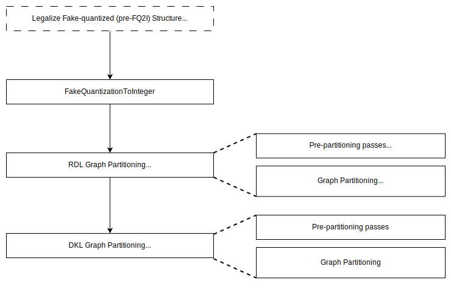
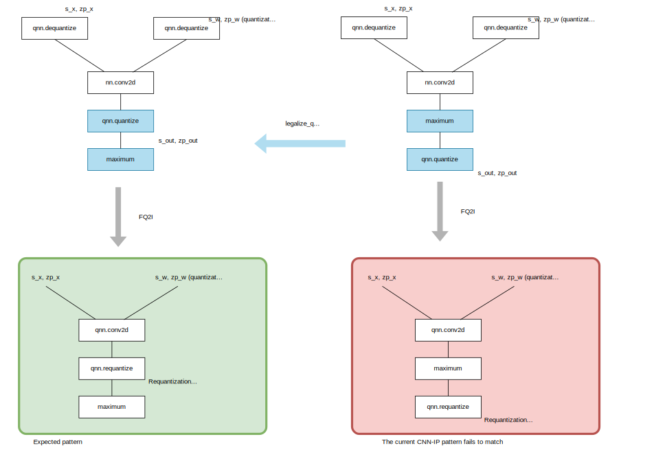

:figure-caption!:

= Applying Relay Passes for R-Car Integrations

The RDL and DKL pattern tables assume that FakeQuantizationToInteger(FQ2I) is applied before the `partition_for_` functions. In addition to that, since TVM's graph partitioning is greedy, the order of `partition_for_` functions matters. In other words, in general, `partition_for_target_A` before `partition_for_target_B` and `partition_for_target_A` after `partition_for_target_B` give different results. Basically, mapping operators to CNN-IP as much as possible is preferable by calling `partition_for_rcar_imp` first. Based on the above, a standard set of passes for the R-Car backends is shown in the following figure.
Refer to link:https://tvm.apache.org/docs/arch/pass_infra.html[Pass Infrastructure] for more information about Relay passes. 

.Pass set for R-Car backends

There are several Relay passes that might be useful in some situations but with caveats.

* link:https://tvm.apache.org/docs/v0.10.0/reference/api/python/relay/transform.html#tvm.relay.transform.SimplifyInference[SimplifyInference]: This pass is usually used to simplify normalization operations (`nn.batch_norm`, `nn.instance_norm`, `nn.l2_normalize`, `nn.layer_norm`, and `nn.group_norm`) and remove Dropout operations. For instance, with the pass and `FoldConstant`, `nn.batch_norm` is simplified into just `multiply` and `add`. From the performance point of view, simplified normalizations are considered to be preferable. However, some normalizations like `nn.instance_norm` cannot be fully const-folded and RDL-/DKL-unsupported operators such as `variance` would remain. 

NOTE: Dropout operations are removed by `RemoveDropoutPass` in `partition_for_rcar_imp`/`partition_for_rcardkl` even without `SimplifyInference`.

* link:https://tvm.apache.org/docs/v0.10.0/reference/api/python/relay/transform.html#tvm.relay.transform.FoldConstant[FoldConstant]: Though this pass is used in various places during compilation, it could affect graph partitioning depending on when it is applied. This is because when `fold_qnn=True`, as described in the link, the pass folds `qnn` operators as well and can break fake-quantized/QDQ operator patterns of Relay graphs, making FQ2I fail if applied before FQ2I. Even when `fold_qnn=False`, some operator patterns might be affected and thus, as a general rule of thumb, using `FoldConstant` before graph partitioning is not recommended. 

NOTE: Necessary or desirable constant folding is applied in `partition_for_rcar_imp`/`partition_for_rcardkl`.

== Legalizing Pre-FQ2I Structure

Depending on models, fake-quantized/QDQ structures can slightly differ and unexpected expression patterns could appear after FQ2I. Taking CNN-IP executable Convolution followed by Maximum as an example, the RDL pattern table expects the structure on the bottom left green box in the figure below. In order for FQ2I to create the sequence, the `qnn.quantize` needs to be between `nn.conv2d` and `maximum` (top left). However, some models can have structures like on the top right where the `qnn.quantize` is at the end. This pattern can possibly be seen in some "CNN-IP-fusion-aware quantized" models. For such cases, `legalize_qdq_for_rcar_imp` tries to convert the structure to match the R-Car pattern tables.

.Rewriting fake-quantized Relay for R-Car backends

== When should parameters be bound?

Some Relay passes including those applied in `legalize_qdq_for_rcar_imp` and `partition_for_` functions require constant parameters are already bound to the main Relay function. Thus, if parameters are represented as variables, `relay.Var` s, they need to be bound to the function in advance using link:https://github.com/apache/tvm/blob/292ecfd21031eef97d8750d553a3cf65c74ecaf8/python/tvm/relay/build_module.py#L463[`relay.bind_params_by_name`]:

[source,python]
----
mod, params = relay.frontend.from_pytorch(model)
# Bind params
mod["main"] = relay.build_module.bind_params_by_name(mod["main"], params)
# ...
with tvm.transform.PassContext(opt_level=3):
    mod = legalize_qdq_for_rcar_imp(mod)
    mod = relay.transform.FakeQuantizationToInteger(hard_fail=False)(mod)
    mod = partition_for_rcar_imp(mod)
    mod = partition_for_rcardkl(mod, True)
    # If you pass `params` to relay.build, they are bound here (`bind_params_by_name` is called in `build`)
    mod = relay.build(mod, targets)
----
