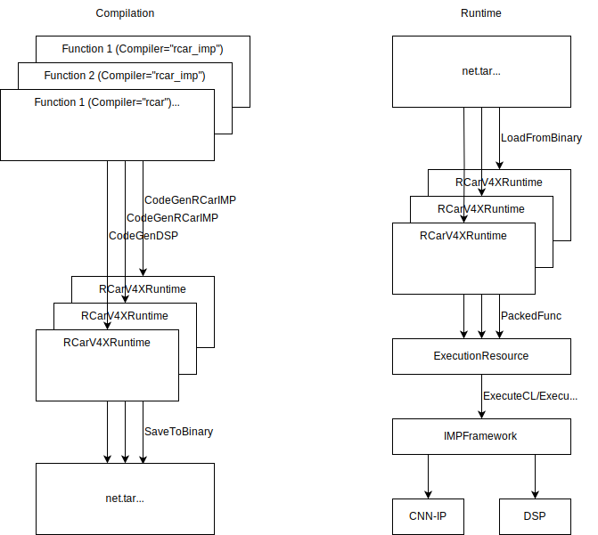

:figure-caption!:

= TVM R-Car V4X Runtime Architecture

== Architecture Summary

The source code of the TVM runtime module for R-Car V4X is located under the `src/runtime/contrib/rcar_v4x/` subdirectory. It contains a few files that define classes that work together using the IMPFW and OSAL APIs from R-Car SDK to execute modules built with either the `rcar_imp` or `rcardkl` backend, for RDL and DKL respectively. The content of the source code files as well as which classes they define is summarized below. Although this runtime meets the requirements for execution using either Python RPC or C++, it does not modify those APIs. For more information about them, as well as general information about how the TVM runtime works, please refer to https://tvm.apache.org/docs/arch/runtime.html.

* rcar_v4x_runtime.cc
** Contains the entry point of the `RCarV4XRuntime` module. Such a module gets created via the global TVM function `runtime.rcar_v4x_runtime_create` called by both `CodeGenRCarIMP` and `CodegenDSP`, from the `rcar_imp` or `rcardkl` backends, at compile time just after generating code for either RDL or DKL, respectively. `RCarV4XRuntime` overrides both `SaveToBinary()` and `LoadFromBinary()` functions from `ModuleNode` allowing TVM to serialize the modules into, for example, a `net.tar` file that users can transfer to R-Car devices either manually or automatically via TVM RPC mechanisms. The `GetFunction()` function is also overridden to allow TVM's `GraphExecutor` to call at runtime functions from `ExecutionResource` as required.

* imp_wrapper.cc
* imp_wrapper.h
* output.proto
** Define helper classes `ExecutionResource`, `OsalTensor`, `Pool`, which provide a high-level API that is based on data structures from TVM, to load command lists and tensors from `cl_bundle` (as defined in the `output.proto` file), as well as ELF files in the case of DSP modules, and to execute them using IMPFW and OSAL. This is also where the `InitializeIMPWrapper()` function is defined, which users can call explicitly to perform initialization and memory allocation externally. When it is not called explicitly, it gets called implicitly, internally.

* imp_framework.cc
* imp_framework.h
* impfw_error.h
** Define low-level helper class `IMPFramework` whose job is mainly to initialize devices as well as execute command lists and DSP programs using IMPFW given via the `Execute()` functions. Since only a single instance of IMPFW can exist per process, it is implemented as a singleton that needs to be acquired with `IMPFramework::GetInstance()`.

* osal_buffer.cc
* osal_buffer.h
* osal_error.h
** Define low-level helper classes `OsalBuffer` and `OsalMemoryManager` whose job is mainly to initialize OSAL as well as provide a bridge with the `DLTensor` data structure from TVM to allocate buffers as appropriate. Since only a single instance of OSAL can exist per process, `OsalMemoryManager` is implemented as a singleton that needs to be acquired with `OsalMemoryManager::GetInstance()`. Unlike command lists, since DSP programs do not support memory address relocation, these files also contain hardcoded addresses that need to match with the ones defined in the `linker_script.ld` file used at compile time for DKL.

* command_list.cc
* command_list.h
** Define a low-level helper class `CommandList` that holds in a `OsalBuffer` the content of a command list for CNN-IP or SDMAC core, parsing it as well as patching it as required for memory address relocation and other hot fixes.

* dsp_program.cc
* dsp_program.h
** Define a low-level helper class `DspProgram` that holds in a `OsalBuffer` the content of an ELF file for a DSP core, parsing it as required using the `DspElf` helper class to obtain and set the required addresses as well as to manage "external memory" via OSAL, to create commands for DKL, and to parse its logs.

* logging.cc
* logging.h
** Contain functions used by RPerf.

Moreover, `src/runtime/cpu_device_api.cc`, `src/runtime/graph_executor/graph_executor.cc`, and `src/runtime/profiling.cc` have also been slightly extended to allocate global OSAL buffers shared by multiple instances of `RCarV4XRuntime`, to allow asynchronous operations between them, as well as to report benchmark results for CNN-IP and DSP cores separately.

== Class Diagram

Below is an incomplete but simple class diagram that further clarifies the interaction between the important classes defined in the files above. None of those classes belong to the R-Car SDK. They are all part of the TVM runtime module for R-Car V4X.

Please note that the `rcar_imp` backend for RDL produces one `RCarV4XRuntime` module per offloaded subgraph (aka `Function`), while the `rcardkl` backend produces a single `RCarV4XRuntime` module for all offloaded subgraphs of the original input `IRModule` (Relay). Those all get bundled by TVM in a single, for example, `net.tar` file.

image::images/runtime-class-diagram.drawio.svg[Class Diagram of the Runtime Module]

== Serialization Data Flow

Here is a diagram to summarize partly how `RCarV4XRuntime` gets created and serialized by the `CodeGenRCarIMP` and `CodegenDSP` during compilation, and how the runtime execution proceeds from there.



All interaction with IMPFW and OSAL are managed by ExecutionResource. It initializes the DspProgram's with elf data, manages OSAL buffers, and executes the DSP programs and the CNN-IP command lists.

== Sequence Diagram

Below is a sequence diagram that illustrates how the various entities interact at run time, and also clarifies the different messages shown in the next section:

```mermaid
sequenceDiagram
    participant I as IMPFramework
    participant C as CallbackArgs
    participant E as ExecuteArgs
    participant F as impfw
    participant c as CallbackFunc
    participant D as DSP
    I->>+E: StartTimer
    deactivate E
    I-)F: R_IMPFW_Execute
    I->>+C: Wait
    F-)+D: Start DSP
    F->>+c: CB_STARTED
    Note right of c: Print message
    deactivate c
    Note right of D: Create logs in DTCM<br/>Copy logs to extmem
    D--)-F: TRAP
    F->>+c: CB_TRAP
    Note right of c: Print message
    c--)C: Notify
    deactivate c
    deactivate C
    I->>+E: StopTimer
    Note right of E: Parse DSP logs from<br/>extmem and print
    deactivate E
```

== Environment Variables

* TVM_RCAR_LOG_EXECUTE_TIME
** When set to any value, execution times such as these will get displayed on the console, after each execution:

----
[13:02:12] /path/to/tvm/src/runtime/contrib/rcar_v4x/imp_framework.cc:69: CallbackFunc(1, 5-1, -1, tvmgen_default_tvmgen_default_rcar_imp_main_0) at xxxxx.xxxxxx ms
[13:02:12] /path/to/tvm/src/runtime/contrib/rcar_v4x/imp_framework.cc:69: CallbackFunc(1, 8-0, -1, tvmgen_default_tvmgen_default_rcar_imp_main_0) at xxxxx.xxxxxx ms
[13:02:12] /path/to/tvm/src/runtime/contrib/rcar_v4x/imp_framework.cc:69: CallbackFunc(1, 5-0, -1, tvmgen_default_tvmgen_default_rcar_imp_main_0) at xxxxx.xxxxxx ms
[13:02:12] /path/to/tvm/src/runtime/contrib/rcar_v4x/imp_framework.cc:69: CallbackFunc(2, 8-0, 0, tvmgen_default_tvmgen_default_rcar_imp_main_0) at xxxxx.xxxxxx ms
[13:02:12] /path/to/tvm/src/runtime/contrib/rcar_v4x/imp_framework.cc:69: CallbackFunc(2, 5-1, 0, tvmgen_default_tvmgen_default_rcar_imp_main_0) at xxxxx.xxxxxx ms
[13:02:12] /path/to/tvm/src/runtime/contrib/rcar_v4x/imp_framework.cc:69: CallbackFunc(2, 5-0, 0, tvmgen_default_tvmgen_default_rcar_imp_main_0) at xxxxx.xxxxxx ms
[13:02:12] /path/to/tvm/src/runtime/contrib/rcar_v4x/imp_framework.cc:272: IMPFramework::Execute() for CNNIP in x.xxxxx ms
[13:02:12] /path/to/tvm/src/runtime/contrib/rcar_v4x/imp_framework.cc:69: CallbackFunc(1, 9-0, -1, tvmgen_default_rcardkl_main_0) at xxxxx.xxxxxx ms
[13:02:12] /path/to/tvm/src/runtime/contrib/rcar_v4x/imp_framework.cc:69: CallbackFunc(2, 9-0, 0, tvmgen_default_rcardkl_main_0) at xxxxx.xxxxxx ms
[13:02:12] /path/to/tvm/src/runtime/contrib/rcar_v4x/imp_framework.cc:272: IMPFramework::Execute() for DSP in x.xxxxxx ms
----

The final line in the above log shows the duration between calls to `StartTimer` and `StopTimer`.

* TVM_RCAR_DSP_LOG
** When set to any value, the content of the DSP log, including error messages on failure and profiling information when enabled, will get parsed and displayed on the console like this, after each execution:

----
logstring: BEGIN_PROCESS_REQUEST
timestamp: 0000193F         +x us 1234a678 255 0
timestamp: 00001C42         +x us 1234a678 002 0
timestamp: 00001FFE         +x us 1234a678 002 0
timestamp: 00002362         +x us 1234a678 002 0
timestamp: 00002724         +x us 1234a678 002 0
timestamp: 00002A88         +x us 1234a678 002 0
timestamp: 00002E4A         +x us 1234a678 002 0
timestamp: 000032D8         +x us 5d0013e0 001 0
timestamp: 0001D034       +xxx us 5d0013e0 001 1
timestamp: 0001D13C         +x us 1234a678 000 0
logstring: END_PROCESS_REQUEST 0
----

The relevant figure here is the duration xxx us of the DSP operator on the penultimate line. Other figures are for debugging purposes and subject to change in future.

* TVM_RCAR_PROFILE_DIR
** When set to an existing path, profile information similar to the above will get saved to files in that directory for use by RPerf.

== Manual Initialization

Although the runtime does not need to be initialized manually, users who wish to have control over memory allocation can call `InitializeIMPWrapper()` as below. Setting the last asynchronous argument to `true` reduces latency, which is the default, but it works correctly only when all operations in the graph get executed by IMPFW, so the runtime will safely override that setting when this is not the case.

```
namespace tvm::runtime::contrib::rcar_v4x {
void InitializeIMPWrapper(impfw_ctrl_handle_t impfw_handle,
                          osal_memory_buffer_handle_t region_buffers[1 + DSP_MAX_CORE_NUM],
                          bool asynchronous);
}

...

tvm::runtime::contrib::rcar_v4x::InitializeIMPWrapper(my_impfw_handle, my_buffer_handles, true);

```
