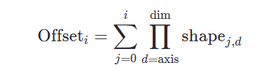

:stem: latexmath
:eqnums: all
:figure-caption!:

= Optimizations in DKL Codegen

There are a couple of noteworthy optimizations applied in the codegen stage:

- Reshape Skipping
- Concat Skipping

== Reshape Skipping

Most reshape operations can be optimized away by replacing them with shape manipulation.
In this section, reshape operations include `relay.reshape`, `relay.expand_dims`, `relay.squeeze`, and `relay.nn.batch_flatten`.

You can see the `reshape` operator in <<reshape_relay>> has been removed in the snippet of <<reshape_cc,generated C++ code>>.

.Input Relay subgraph
[source, id=reshape_relay]
----
def @main(%x: Tensor[(1, 8, 8, 1), int8]) {
  %0 = reshape(%x, newshape=[2, 4, 8]);
  qnn.mul(%0, meta[relay.Constant][0], 1f, 0, 1f, 0, 1f, 0)
}
----

.Generated C++ code
[source,cpp, id=reshape_cc]
----
extern "C" void tvmgen_default_rcardkl_main_0(void) {
  const auto& const_pool = graph::GetTensorRegister(0);
  {
    // tvmgen_default_rcardkl_main_0_rcardkl_reshape has been removed.
  }
  {
    kernel::MulAttributeInfo<std::int8_t> attr{};
    KernelArgs * p_input_args = nullptr;
    KernelArgs * p_output_args = nullptr;
    rcardkl::graph::GetInOutKernelArgs(&p_input_args, &p_output_args);
    // rcardkl_0_i0
    p_input_args->args[0] = graph::GetTensorRegister(  1);
    // Reshape: rcardkl_0_i0
    {
      std::memset(p_input_args->args[0].shape, 0, sizeof(p_input_args->args[0].shape));
      p_input_args->args[0].shape[0] = 2;
      p_input_args->args[0].shape[1] = 4;
      p_input_args->args[0].shape[2] = 8;
      std::memset(p_input_args->args[0].stride, 0, sizeof(p_input_args->args[0].stride));
      p_input_args->args[0].stride[0] = 32;
      p_input_args->args[0].stride[1] = 8;
      p_input_args->args[0].type_id = 1;
      p_input_args->args[0].dim = 3;
    }

    /* ... */

    // tvmgen_default_rcardkl_main_0_qnn_mul
    p_output_args->args[0] = graph::GetTensorRegister(  2);
    p_output_args->size = 1;
    kernel::ssp::Mul(p_input_args, p_output_args, &attr);
  }
}
----

=== Implementation Details

Reshape skipping is achieved by not emitting a DKL function call for the removed reshape and instead emitting appropriate shape changes right before its uses. Since removed reshape ops do not need to have dedicated buffers, they are not assigned dedicated tensor registers as well. On the other hand, the live range of a Relay expression to be reshaped needs to be extended towards consumers. Specifically, it ends at the successor op that has the largest op-id as depicted in the following figure.

.Schematic overview of removing Reshape op
image::../images/reshape_opt.svg[]

=== Conditions

A reshape op is skipped if the following conditions are met:

* The reshape is a float32 operation or an int8 operation without requantization.
** This condition comes from the current supported data types of DKL and the TVM DKL backend.
* The reshape is not a subgraph's output.
** This can be relaxed to "The argument is not a subgraph's input and the reshape is not a subgraph's output".
* The memory layout of the tensor to be reshaped is contiguous.

Theses conditions are checked in `IsRemovableReshape` function defined in `codegen_utils.cc`.

NOTE: `std::memcpy` may be called for some unremovable reshape ops that have no DKL implementations.

== Concat Skipping [#concat_optimization]

In general, the operation of concat is to copy a finite number of input tensors, which are usually not adjacent in memory, to a single output tensor that has a contiguous layout.
The copying can be removed by setting output data pointers of direct predecessor operations appropriately. A detailed explanation follows in the successive sections.

You can see the `concatenate` operator in <<concat_relay>> has been removed in the snippet of <<concat_cc,generated C++ code>>.

.Input Relay subgraph
[source, id=concat_relay]
----
def @tvmgen_default_rcardkl_main_0(%rcardkl_0_i0: Tensor[(2, 14, 31, 23), int8] /* ty=Tensor[(2, 14, 31, 23), int8] */, %rcardkl_0_i3: Tensor[(2, 14, 31, 23), int8] /* ty=Tensor[(2, 14, 31, 23), int8] */, %rcardkl_0_i6: Tensor[(2, 14, 31, 23), int8] /* ty=Tensor[(2, 14, 31, 23), int8] */, %rcardkl_0_i9: Tensor[(2, 14, 31, 23), int8] /* ty=Tensor[(2, 14, 31, 23), int8] */, %rcardkl_0_i12: Tensor[(2, 14, 31, 23), int8] /* ty=Tensor[(2, 14, 31, 23), int8] */, Compiler="rcardkl", Primitive=1, Inline=1, global_symbol="tvmgen_default_rcardkl_main_0") -> Tensor[(10, 14, 31, 23), float32] {
  %0 = qnn.dequantize(%rcardkl_0_i0, 1f /* ty=float32 */, 0 /* ty=int32 */, out_dtype="float32") /* ty=Tensor[(2, 14, 31, 23), float32] */;
  %1 = qnn.dequantize(%rcardkl_0_i3, 1f /* ty=float32 */, 0 /* ty=int32 */, out_dtype="float32") /* ty=Tensor[(2, 14, 31, 23), float32] */;
  %2 = qnn.dequantize(%rcardkl_0_i6, 1f /* ty=float32 */, 0 /* ty=int32 */, out_dtype="float32") /* ty=Tensor[(2, 14, 31, 23), float32] */;
  %3 = qnn.dequantize(%rcardkl_0_i9, 1f /* ty=float32 */, 0 /* ty=int32 */, out_dtype="float32") /* ty=Tensor[(2, 14, 31, 23), float32] */;
  %4 = qnn.dequantize(%rcardkl_0_i12, 1f /* ty=float32 */, 0 /* ty=int32 */, out_dtype="float32") /* ty=Tensor[(2, 14, 31, 23), float32] */;
  %5 = (%0, %1, %2, %3, %4) /* ty=(Tensor[(2, 14, 31, 23), float32], Tensor[(2, 14, 31, 23), float32], Tensor[(2, 14, 31, 23), float32], Tensor[(2, 14, 31, 23), float32], Tensor[(2, 14, 31, 23), float32]) */;
  concatenate(%5) /* ty=Tensor[(10, 14, 31, 23), float32] */
}
----

.Generated C++ code
[source,cpp, id=concat_cc]
----
extern "C" void tvmgen_default_rcardkl_main_0(void) {
  const auto& const_pool = graph::GetTensorRegister(0);
  {
    kernel::DequantizeLinearAttributeInfo<std::int8_t> attr{};
    KernelArgs * p_input_args = nullptr;
    KernelArgs * p_output_args = nullptr;
    rcardkl::graph::GetInOutKernelArgs(&p_input_args, &p_output_args);
    // rcardkl_0_i0
    p_input_args->args[0] = graph::GetTensorRegister(  1);
    // ...
    // tvmgen_default_rcardkl_main_0_qnn_dequantize
    // Concat: the offset in tvmgen_default_rcardkl_main_0_concatenate is 0
    p_output_args->args[0] = graph::GetTensorRegister(  2);
    p_output_args->args[0].p_data = static_cast<float *>(p_output_args->args[0].p_data) + 0;
    // ...
    kernel::ssp::DequantizeLinear(p_input_args, p_output_args, &attr);
  }
  {
    kernel::DequantizeLinearAttributeInfo<std::int8_t> attr{};
    KernelArgs * p_input_args = nullptr;
    KernelArgs * p_output_args = nullptr;
    rcardkl::graph::GetInOutKernelArgs(&p_input_args, &p_output_args);
    // rcardkl_0_i3
    p_input_args->args[0] = graph::GetTensorRegister(  3);
    // ...
    // tvmgen_default_rcardkl_main_0_qnn_dequantize_1
    // Concat: the offset in tvmgen_default_rcardkl_main_0_concatenate is 19964
    p_output_args->args[0] = graph::GetTensorRegister(  2);
    p_output_args->args[0].p_data = static_cast<float *>(p_output_args->args[0].p_data) + 19964;
    // ...
    kernel::ssp::DequantizeLinear(p_input_args, p_output_args, &attr);
  }
  {
    kernel::DequantizeLinearAttributeInfo<std::int8_t> attr{};
    KernelArgs * p_input_args = nullptr;
    KernelArgs * p_output_args = nullptr;
    rcardkl::graph::GetInOutKernelArgs(&p_input_args, &p_output_args);
    // rcardkl_0_i6
    p_input_args->args[0] = graph::GetTensorRegister(  4);
    // ...
    // tvmgen_default_rcardkl_main_0_qnn_dequantize_2
    // Concat: the offset in tvmgen_default_rcardkl_main_0_concatenate is 39928
    p_output_args->args[0] = graph::GetTensorRegister(  2);
    p_output_args->args[0].p_data = static_cast<float *>(p_output_args->args[0].p_data) + 39928;
    // ...
    kernel::ssp::DequantizeLinear(p_input_args, p_output_args, &attr);
  }
  {
    kernel::DequantizeLinearAttributeInfo<std::int8_t> attr{};
    KernelArgs * p_input_args = nullptr;
    KernelArgs * p_output_args = nullptr;
    rcardkl::graph::GetInOutKernelArgs(&p_input_args, &p_output_args);
    // rcardkl_0_i9
    p_input_args->args[0] = graph::GetTensorRegister(  5);
    // ...
    // tvmgen_default_rcardkl_main_0_qnn_dequantize_3
    // Concat: the offset in tvmgen_default_rcardkl_main_0_concatenate is 59892
    p_output_args->args[0] = graph::GetTensorRegister(  2);
    p_output_args->args[0].p_data = static_cast<float *>(p_output_args->args[0].p_data) + 59892;
    // ...
    kernel::ssp::DequantizeLinear(p_input_args, p_output_args, &attr);
  }
  {
    kernel::DequantizeLinearAttributeInfo<std::int8_t> attr{};
    KernelArgs * p_input_args = nullptr;
    KernelArgs * p_output_args = nullptr;
    rcardkl::graph::GetInOutKernelArgs(&p_input_args, &p_output_args);
    // rcardkl_0_i12
    p_input_args->args[0] = graph::GetTensorRegister(  6);
    // ...
    // tvmgen_default_rcardkl_main_0_qnn_dequantize_4
    // Concat: the offset in tvmgen_default_rcardkl_main_0_concatenate is 79856
    p_output_args->args[0] = graph::GetTensorRegister(  2);
    p_output_args->args[0].p_data = static_cast<float *>(p_output_args->args[0].p_data) + 79856;
    // ...
    kernel::ssp::DequantizeLinear(p_input_args, p_output_args, &attr);
  }
  {
    // tvmgen_default_rcardkl_main_0_concatenate has been removed.
  }
}
----

=== Implementation Details

Concat skipping is achieved by not emitting a DKL function call for the removed concat and instead appropriately setting the output data pointers and strides of the predecessor operations so that they directly write the results to the single buffer, stem:[B_\mathrm{concat}].
The offset in stem:[B_\mathrm{concat}] of the stem:[i]-th input can be calculated as <<offset>>.
Since the predecessors do not need to have dedicated buffers, they are not assigned dedicated tensor registers as well.
On the other hand, the live range of the removed concat needs to be extended toward the input ops. Specifically, it starts from the start point of the predecessor op that has the smallest op-id as in the figure blow.

.Schematic overview of removing Concat op
image::../images/concat_opt.svg[]

This process is applied recursively for a sequence of removable concats:

.A sequence of removable concats
image::../images/multi_concats.svg[]

=== Conditions

A concat op is skipped if the following conditions are met:

* The concat is a float32 operation or an int8 operation without requantization.
** This condition comes from the current supported data types of DKL and the TVM DKL backend.
* The arguments is a `TupleNode` that does not contain subgraph's inputs (`Var`) or constants (`Constant`)
* If the concat axis is not outermost and all predecessor DKL operators support strided output, or the axis is (virtually) outermost.
** Currently, only `DequantizeLinear` supports innermost strided output.
** Note that if all input dimensions outer than the axis are 1, this falls into the outermost case. For instance, if the input shapes are `(1, 1, *, 3)` and the axis is `3`, then the condition is met.
* The concat does not have sibling ops:
+
.Concat op with a sibling op
image::../images/sibling.svg[]

These conditions are checked in `IsRemovableConcat` function defined in `codegen_utils.cc`.
