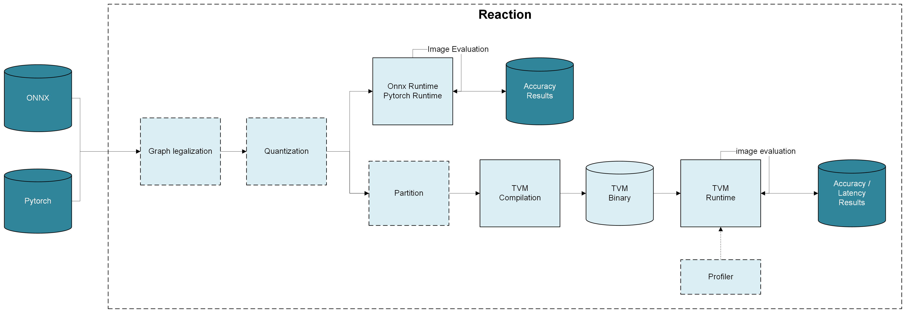
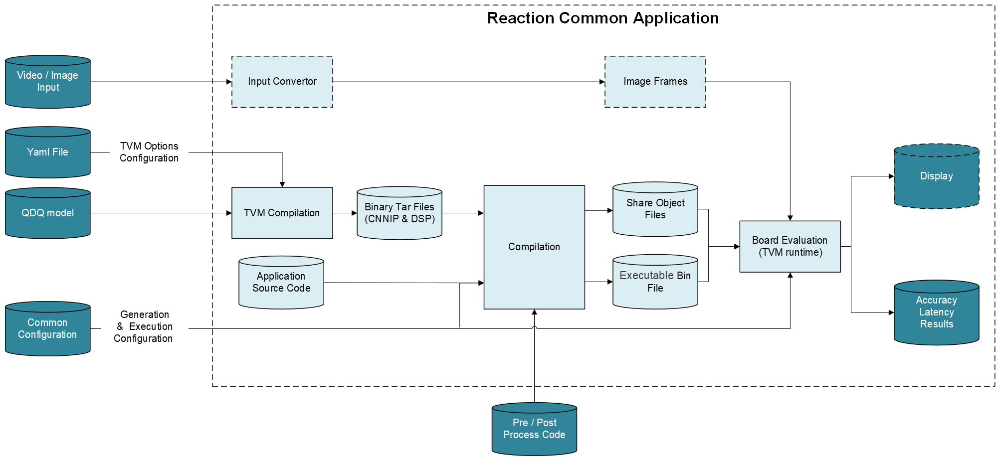
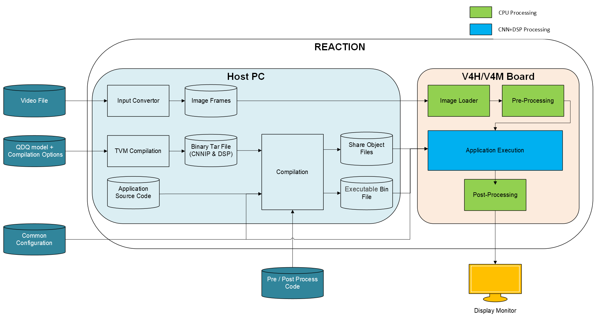

== REACTION (Renesas Edge AI Compilation Tool Into Optimized Networks)

=== 1. Overview

REACTION is an integrated repository platform that supports the seamless
integration of various tools such as quantizer and compiler etc, and
model repositories, enabling users to easily add their model
repositories and execute them rapidly on Renesas AI accelerators, such
as V4H2 and V4M. Currently, REACTION supports multiple model sources,
including MMLab, ML Commons, Hugging Face, Torch Hub, and custom models.

Built on top of TVM compiler, REACTION supports ONNX and PyTorch model
inputs, and output the accuracy or latency results according user’s
need. Users can compile neural network models through REACTION on their
host PCs and execute these models on V4H/V4M boards using either the TVM
RPC protocol or TVM Runtime.

Currently, the ONNX frontend supports opset 13 for most models, while
opset 17 is available for Transformer models, such as Swin and ViT.

=== 2 REACTION CLI(Command Line Interface) User Journey

==== 2.1 REACTION CLI

User can get REACTION CLI information with command: `reaction --help`.

[source,bash]
----
usage: reaction

positional arguments:
  {start,bond,with}
    start            Start Docker containers and delegate processes in each containers
    bond             Register BYOM in REACTION
    with             Run custom command with BYOM
    docker           docker commands wrapper for REACTION docker images

options:
  -h, --help         show this help message and exit
----

Details of supported CLI information, please refer to the following.

[source,bash]
----
reaction
├─ start                               (Start Docker containers and delegate processes in each containers)
│   ├─ --ryaml <your_yaml_file>        (Custom named reaction.yaml file)  
│   ├─ -a, --action <specified_action> (Deploy action (go,opt,train,debug,profile,agility,app))
│   │   ├─ go                          (Execute the specified task)         
│   │   ├─ profile                     (Use a profiler to gather performance metrics during execution)
│   │   ├─ agility                     (To test latency only for BYOM models)
│   │   └─ app                         (Execution using COMMON APP and automatically choosing the core(CNNIP, DSP, CPU) usage)
│   ├─ --model_name <model_name>       (Model name of validated network in REACTION and logged in REGISTER)
│   ├─ -n, --name <experiment_name>    (Experiment id, str or integer)
│   ├─ -t, --task <specified_task>     (Deployment task (pytorch,onnxruntime,quant_onnx,quant_torch,tvm_cpu,tvm_cch,tvm_cdh))
│   │   ├─ pytorch                     (Download PyTorch model,execute accuracy evaluation using pytorch runtime on host x86 PC)         
│   │   ├─ onnxruntime                 (Convert PyTorch model to FP32 ONNX and execute accuracy evaluation using ONNX Runtime on host x86 PC)
│   │   ├─ quant_onnx                  (Quantize an FP32 ONNX or Pytorch model based on R-Car quantization tool(fp32-> int8/int16/mixed)? And execute accuracy evaluation using ONNX Runtime on host x86 PC)
│   │   ├─ tvm_cpu                     (Compile a rcar-quantized model with TVM and execute accuracy evaluation using tvm runtime on host x86 PC)
│   │   ├─ tvm_cch                     (Compile a rcar-quantized model with TVM and execute accuracy and latency evaluation using tvm runtime on  CNNIP + CPU of V4H/V4M Board)
│   │   └─ tvm_cdh                     (Compile a rcar-quantized model with TVM and execute accuracy and latency evaluation using tvm runtime on  CNNIP + DSP + CPU of V4H/V4M Board)
│   ├─ -c, --compile <qdq model>       (Compile Quantized ONNX model to target TVM Backend)
│   ├─ -w, --weights <weight>          (Quantized ONNX model path)
│   ├─ --target {v4h2, v4m}            (V4X target board, range{v4h2, v4m})
│   └─ --re RE                         (Recompile the model and delete previously compiled binary)
├─ bond                                (Register BYOM in REACTION)
│   ├─ -am, --accuracy                 (Registration for BYOM to evaluate accuracy in REACTION)         
│   └─ -l,  --latency                  (Registration for BYOM to evaluate latency in REACTION)
├─ with                                (Run custom command with BYOM)
│   └─ cmd                             (Postprocessing script command for BYOM,ex:`reaction with python <your script> --<your args> <argument values> <other arguments>`) 
└─ docker                              (Docker commands wrapper for REACTION docker images)
    ├─ build                           (Build reaction docker images)
    │   ├─ --device {v4h2,v4m}         (Target v4x board to build docker image)         
    │   ├─ --compute {cpu,gpu}         (Compute power of docker images)
    │   ├─ --target_os {linux}     (Target OS argument)
    │   ├─ --tvm-v4h2 <tvm_v4h2_ver>   (TVM v4h2 version to build docker image)         
    │   ├─ --tvm-v4m  <tvm_v4m_ver>    (TVM v4m version to build docker image)
    │   ├─ --tvm-pack {,-manual}       (TVM package name type)
    │   ├─ --dkl-ver <dkl_version>     (DKL version)         
    │   ├─ --rcar_xos <sdk_version>    (R-Car XOS SDK version)
    │   ├─ --ort_version <ort_version> (ORT quantizer version)
    │   ├─ --torch_version <torch_version>     (TorchScript quantizer version)
    │   ├─ --rperf <profiler_version>  (Profiler version)
    │   ├─ -t, --tag <tags>            (Name and optionally a tag (format: 'name:tag'))
    │   ├─ --target {package,release,local}     (Set the target build stage to build image)
    │   ├─ --services <SERVICES>       (Build specific docker images)
    │   ├─ --user <user_tag>           (Docker images with username)
    │   ├─ --net {host,reaction}       (Docker network during docker build)
    │   ├─ --open                      (Build open reaction docker images)
    │   ├─ --no-cache                  (Build docker images without cache)
    │   └─ --certfix {base,cert}       (Use ZScalar certificate for security in docker build)
    ├─ save                            (Save reaction docker images to tarball)
    │   ├─ --type {open,closed}        (Open or closed REACTION type)         
    │   ├─ --device {v4h2,v4m}         (Target v4x board to build docker image)
    │   ├─ --compute {cpu,gpu}         (Compute power of docker images) 
    │   └─ -o, --output <filename>     (Output filename to store REACTION image tarball)
    └─ load                            (Load REACTION docker images from tarball)
        ├─ --type {open,closed}        (Open or closed REACTION type)         
        ├─ --device {v4h2,v4m}         (Target v4x board to build docker image)
        └─ --compute {cpu,gpu}         (Compute power of docker images)
----

==== 2.2 REACTION Yaml Experiment CLI

Experiment configuration items in YAML files are another additional form
of CLI that can be added to REACTION.

[source,bash]
----
experiment:
  name: my_test # Optional
  model_name: ResNet18
  task: tvm_cdh
  line: onnx
  action: go
  target: v4h2
  convert_configs:
    tvm:      
      host: <ip address>
      port: <port number>
      user: <account of Board> (optional, default is root)
      passwd: <passwords> (optional, default is NONE)
----

The definition of basic items in the experiment of Yaml file is
explained below:

[source,yaml]
----
Configuration
├─ name                               (Refer to 'reaction start --name')
├─ model_name                         (Refer to 'reaction start --model_name', they are unique and case-sensitive)
├─ task                               (Refer to 'reaction start ---task')
├─ action                             (Refer to 'reaction start --action')
├─ line                               (Line to follow for model conversion and inference)
│   ├─ onnx                           (Follow ONNX conversion and inference line)  
│   └─ torch                          (Follow PyTorch conversion and inference line)
├─ target                             (Refer to 'reaction start --target')
├─ target_os                          (Refer to 'reaction build --target_os')
└─ convert_configs                    (Configuration options for model conversion)
    ├─ pytorch                        (Configurations for pytorch model downloading, available for task 'pytorch')
    │   └─ option list                (Refer following table)
    ├─ onnxruntime                    (Configurations for pytorch to ONNX conversion, available for task 'onnxruntime')
    │   └─ option list                (Refer following table)
    ├─ quantization                   (Quantization configs, available for task 'quant_onnx')
    │   └─ option list                (Refer following table)
    └─ tvm                            (TVM compilation configurations, available for task 'tvm_cch' and 'tvm_cdh')
        └─ option list                (Refer following table)
----

*Note*:

1.The experimental tree presented above highlights only the basic
configuration items. For a comprehensive list of additional
configuration options, please refer to the source code located at
`reaction/configs/schema.json`.

2.When executing the task: `tvm_cpu`, there is no need to add
`convert_configs`.

===== Option list for `convert_configs.pytorch`

[width="100%",cols="20%,20%,20%,20%,20%",options="header",]
|===
|Configuration Item |Options |Sub-Options |Default |Description
|pytorch |skip_save |– |False |Whether to skip saving the PyTorch model
after conversion

| |not_available |– |False |Pytorch model not available for download
|===

===== Option list for `convert_configs.onnxruntime`

[width="100%",cols="20%,20%,20%,20%,20%",options="header",]
|===
|Configuration Item |Options |Sub-Options |Default |Description
|onnxruntime |export_params |– |True |Indicates whether parameters
should be exported during conversion

| |patch |– |– |Configurations to apply patches to the ONNX model for
optimization

| | |plugins |None |List of plugins to be applied

| | |custom_plugins |None |List of custom plugins to be applied

| | |mode |manual |Mode of applying the plugin (manual or auto)

| | |apply_patch |False |Apply ONNX patch or not

| |keep_initializers_as_inputs |– |False |Whether to keep initializers
as inputs

| |opset_version |– |13 |Target opset version for pytorch to ONNX
conversion

| |save_file |– |./end2end.onnx |ONNX model save file name

| |input_names |– |[`input'] |List of input nodes for the model

| |output_names |– |[`output'] |List of output names for the model

| |input_shape |– |None |Input shape configuration

| |onnx_simplify |– |True |Whether to simplify the ONNX model

| |ort_quant_preprocess |– |True |Whether to preprocess for quantization
with ONNX Runtime

| |skip_symbolic_shape_inf |– |False |Whether to skip symbolic shape
inference

| |remove_node_names |– |[] |List of nodes name to remove

| |partition |– |– |ONNX Partition configuration, support partition
postprocess_edges, preprocess_edges or both

| | |type |None |Type of partition, manual or auto or three_way

| | |preprocess_edges |None |Boundary names to partition preprocessing
of model

| | |postprocess_edges |None |Boundary names to partition postprocessing
of model

| |format |– |nchw |Convert image format
|===

===== Option list for `convert_configs.quantization`

[width="100%",cols="20%,20%,20%,20%,20%",options="header",]
|===
|Configuration Item |Options |Sub-Options |Default |Description
|quantization |skip_quantization |– |False |To skip the Quantization
process

| |backend |– |rcar_ort_quantizer |Backend function for quantization

| |activation_type |– |QInt8 |Activation bit type for quantization

| |weight_type |– |QInt8 |Weight bit type for quantization

| |calibration_method |– |MinMax |Calibration method for quantization

| |calib_data_root |– |None |Custom dataset for calibration of model

| |dataset_samples |– |100 |Number of data sample to be used for
calibration

| |nodes_to_exclude |– |None |Nodes to exclude form quantization

| |fuse_preprocess |– |False |Fuse input image preprocessing to model

| |extra-options |– |– |Pass extra options in onnxruntime for advanced
quantization

| | |weight_symmetric |True |Apply weight_symmetric

| | |activation_symmetric |False |Apply activation_symmetric

| | |calib_percentile |None |Constant to determine what percentage of
tensor range to treat as a range of float

| | |calib_num_bins |None |Constant to specify number of bins for
calibration methods that creates histogram

| | |calib_dataset_stride |None |Split dataloader of calibration to
avoid memory overflow

| | |calib_save_hist |None |Path to save the histogram data. If None,
this is ignored

| | |calib_load_hist |None |Path to load the histogram data. If None,
this is ignored

| | |enable_gelu_fusion |False |Enable GeLU fusion during quantization

| | |bias_overflow_prevention_nodes |None |Bias overflow prevention
nodes during quantization

| | |bias_overflow_prevention_all |True |Enable bias overflow prevention
nodes during quantization

| | |int16_activations |None |Names of tensors to be quantized with
int16

| | |search_window_threshold |None |Constant to determine the lower
limit of search window width

| | |fine_grained_search_step |None |Step for the 2nd stage of search,
the fine-grained search, of entropy calibration

| | |long_tail_distribution_countermeasure |None |whether to use
special measurement for searching the optimal range of long-tail
distribution. Now `MinMax' is the only acceptable value. If None, this
is ignored

| | |totensor |False |Enable totensor inside InsertPreprocess on
fuse_preprocess only

| | |permute |False |Enable permute inside InsertPreprocess on
fuse_preprocess only
|===

===== Option list for `convert_configs.tvm`

[width="100%",cols="20%,20%,20%,20%,20%",options="header",]
|===
|Configuration Item |Options |Sub-Options |Default |Description
|tvm |out |– |`model.tar` |Compiled model binary file name

| |opt_level |– |3 |Opt level for compilation

| |targets |– |[``llvm''] |TVM backend hardware target

| |timeout |– |7200 |Compilation timeout, uint: seconds

| |use_vm |– |False |TVM backend hardware target

| |optimization |– |False |Optimize TVM output

| |rcardkl_enable_senspro_ops |– |True |Enable rcardkl senspro for
optimized operators

| |rcardkl_skip_concat |– |True |Enable rcardkl concat skipping

| |skip_simplify_inference |– |False |Skip simplify inference

| |merge_regions |– |True |Merge regions of model for TVM compile

| |estimator |– |False |Enable estimator pattern table generation

| |cnnip_batch_size |– |1 |CNNIP batch size

| |convert_argmax_to_int8 |– |False |Enable convert Argmax to int8

| |remove_cast |– |False |Enable remove cast

| |cut_ends |– |False |Enable remove input quantize linear and output
dequantize linear nodes from network graph

| |remove_input_quantize |– |False |Enable remove input quantize linear
node from network graph

| |remove_output_dequantize |– |False |Enable remove output dequantize
linear node from network graph

| |skip_mean_quantization |– |False |Enable skip mean quantization

| |keep_app_folder |– |False |Enable keep app folder, only for common
application

| |dsp_hcore |– |[0] |Number of DSP cores for Multi-threading in V4H2
board

| |dsp_mcore |– |[0] |Number of DSP cores for Multi-threading in V4M
board

| |enable_mathlib |– |None |Enable MathLib for TVM compilation

| |host |– |None |V4X host address

| |port |– |None |V4X port address

| |ssh_port |– |22 |V4X SSH port address

| |user |– |None |Username to connect to v4x board (optional)

| |passwd |– |None |Password to connect to v4x board (optional)

| |prof_dir |– |`mylogs` |Directory to store TVM profiling logs

| |profile_level |– |3 |Level of binary profiling

| |cnnip_skip_layers |– |None |List of layers to skip offloading to
CNNIP

| |dsp_skip_layers |– |None |List of layers to skip offloading to DSP

| |heuristic_partition |– |None |Enable heuristic partitioning during
TVM compilation

| |format |– |nchw |Convert image format

| |custom_node_config_path |– |None |path of the json file showing the
custom nodes inputs, start points and parameters

| |wupslp |– |False |Whether to enable wupslp or not in tvm_cdh task

| |tvm_benchmark_config |– |– |TVM benchmark settings

| | |repeat |1 |Repeat number

| | |number |10 |Number of executions on board

| | |benchmark_only |False |Skip inference, only benchmark only
|===

=== 3 Common Application in REACTION

==== 3.1 Overview

REACTION supports common application to run models on V4H2 or V4M. The
primary use case is to validate the performance of product-level AI
models on the target devices, leveraging multi-threading and multi-core
capabilities to enhance model performance. REACTION can generate
standalone applications with executables for each model, copy necessary
files to V4H or V4M board, run on board and display the performance
results.

Following figure shows the flow chart of common application in REACTION.

Common application offers a wide range of sample references, such as :

* `Classification Models`
* `Object Detection Models`
* `Semantic Segmentation Model`
* `Depth Estimation Model`
* `Parallel Execution of Multiple Models`
* `Visualization for varied models`

*Note*:Please note that the TVM RPC server is not used in common
application cases. Refer to comparison table shown below:

[width="100%",cols="^12%,^26%,^29%,^11%,^22%",options="header",]
|===
|Name |Feature |Limitation |Execution Method |Compilation Chain
|RPC server |Fast evaluation on sequential execution |Sequential
execution (not for pipelining) and no support on multi-DSP core layers
|Remote communication |TVM model compilation

|Common Application |C++ based AI model running on a target device with
support on pipelining execution and multi-DSP cores |Refer to section
`Limitations' in this chapter |Local execution |TVM model compilation +
Model (.so) compilation + Application compilation
|===

==== 3.2 Operation Flow

===== Preparation

The common application docker images are not built by default, users will have to specify the app build using the below reaction docker command:

[source,bash]
----
reaction docker build --services tvm-app
----

Before the operation, please prepare the files as shown in the flow
chart, and please copy the model folders that include the
prepostproc.cc, input qdq files, Makefile, exec_config.json etc to the `reaction/models` (if not
please create a new).

===== Yaml configuration

Take the `MobileNet_v1-app` as an example, configure the `reaction.yaml`
file as follows, for details about each parameter function, please refer
to `section REACTION CLI` and
`section REACTION Yaml Experiment CLI`.

Please make sure the configuration of `task` and `action` unchanged,
only `task: tvm_cdh` and `action: app` supported in common application
case.

[source,yaml]
----
experiment:
  model_name: MobileNet_v1-app
  task: tvm_cdh
  action: app
  target: v4h2
  line: onnx
  convert_configs:
    tvm:
      host: <ip address>
      user: <account of Board> (optional, default is root)
      passwd: <passwords> (optional, default is NONE)
      ssh_port: <SSH port> (optional, default is 22)
      remove_input_quantize: <whether to remove the quantize node near the input node> (optional, default is False)
      remove_output_dequantize: <whether to remove the dequantize node near the output node> (optional, default is False)
      skip_mean_quantization: <whether to skip the quantization of mean nodes> (optional, default is False)
      keep_app_folder: <whether to keep the output folder (app_temp) on the board> (optional, default is False)
      convert_argmax_to_int8: <whether to convert argmax node to int8> (optional, default is False)
----

Note for the configs:

* If you need to use a SSH port other than the default port `22`, please
configure this option.
* When running the provided case, both `remove_input_quantize` and
`remove_output_dequantize` *must* be set to `true`.
* When running the `ResNet50-app` case, it is essential to enable
`skip_mean_quantization`
* For users running their own cases, it is strongly recommended to set
`remove_input_quantize` and `remove_output_dequantize` to `true`, and
then configure the quantization or dequantization values through the
`exec_config.json` file.
* In addition to the `model_name`, possibly the username and password of
the user board also needed according the user’s real status.

===== Run

To execute the job, run the following command.

[source,bash]
----
reaction start
----

After the command, following process will be done.

* parse the configuration files and generate the application. Here
exec_config.json file is used.
* compile the model, generate tar file, so file and executable bin file.
* prepare input images and special inputs preprocessing if needed.
* copy files to board and run. Here exec_config.json file is used.
* logs print, outputs save and display if needed.

===== Output

After running the job, the program will print the following output logs.

[source,shell]
----
Total exec time (ms): ***
Loop count: ***
Throughput inv. (ms): ***
Throughput (fps): ***
----

* *Performance Metrics:* Metrics such as frame rate and execution time
will be logged based on the configuration. 
**  `Total exec time (ms)` is the total time used to process the images. 
**  `Loop count` is the number of images that have been processed. 
**  `Throughput inv. (ms)` is the average time used to process a single image. 
**  `Throughput (fps)` is the average number of images that can be processed per second.

* *Print Inference:* If you change the `print_inference` options to
`true` inside the exec_config.json file, and run the job again.

[source,json]
----
"print_inference": true
----

The program will print the following output with results:

[source,shell]
----
Thread (0) Top-1 prediction:  class_id = *** , score = ***
Thread (1) Top-1 prediction:  class_id = *** , score = ***
Thread (2) Top-1 prediction:  class_id = *** , score = ***
Thread (3) Top-1 prediction:  class_id = *** , score = ***
Total exec time (ms): ***
Loop count: ***
Throughput inv. (ms): ***
Throughput (fps): ***
----

The results will be printed in console or file, which is based on the
definition of postprocessing in the `prepostproc.cc`. In current provided samples, output types can be as follows:

* console log (also can be found in `Log` file).
* txt files(`*.txt` in its app folder).

*Note*: In case `print_inference` is true, Performance Metrics will
include the time taken to print or save the output. It is recommended to
use the data with `print_inference` false as a performance reference.

Additionally, output of each run stage can be found under the
`work_dir/`, refer as follows:

* *Common application output folder:*
** *Location:* `work_dir/mobilenet_v1-app/tvm-{device}`
** *Description:*
*** Contains the `models` folder, which contains the model .so libs and
the model .tar middleware.
*** Contains the `test_data` folder, which contains the input images
downloaded from internet.
*** Contains the `tvmgen_default_tvmgen_default_rcar_imp_main` folder,
which contains the debugging files generated by RDL. It could be a
series of folders containing debugging files regarding the number of
CNN-IP graph you have. And it is generated only when the model has
layers processed on CNN-IP, and the folder number remains the same as
the CNN-IP partition number shown in the Relay information file
`tvm_model_relay.txt'.
*** Contains the `dkl_artifacts` folder, which contains the debugging
files generated by DKL. It could be a series of folders containing
debugging files regarding the number of DSP core you used, and the files
in this folder are generated only when the model has layers processed on
DSP.
*** Contains the `Log` file, which records the APP Log printed by the
board.
*** Contains the `onnx_model_relay.txt` file, which records Relay
information of ONNX model.
*** Contains the `tvm_model_relay.txt` file, which records model Relay
information after TVM processing.
*** Contains the `tvm_model_graph.json` file, which records model graph
information after TVM processing.

==== 3.3 Limitations

The Common Application Model registry in REACTION allows users to
specify and manage models, currently, models’ deployment implementations
are provided as `Chapter 4.1 Overview` showed. Support for the unlisted
models is not guaranteed. Please be aware of the following limitations
when bringing custom models into this application.

Before creating common application for custom model, the user has to
quantize the main part of the target model into ONNX QDQ format using
custom dataset and pre-processing. ONNX QDQ model will be later compiled
into the target binary for the R-Car SoC. The user can choose to have
pre-processing or post-processing in ONNX or to use the pre-processings
and post-processings that come along with other supported models.
*Current REACTION only contains the pre-processing and post-processing
functionality for the supported models.* The user can always refer to
those implementations but the quality cannot be assured on the modified
pre-processing and post-processing functions.

When adopting this common application into the ones with other models,
the user may also have their model partitioning strategy. Those
partitioning changes may lead to application changes, which need further
modification to port the model to this application.

===== Limitations only for V4M

If you want to run the model using v4m, please modify the `target` to
`v4m` in the yaml file. Compared to V4H2, V4M has two fewer DSP cores,
so when using multi-threads, the user should not use the .so files
compiled for DSP core 2 and DSP core 3 (e.g. model_dsp2.so,
model_dsp3.so) as input for the common application.

The Docker image used for V4M is not built by default with the `reaction
docker build' command. Please run the command below to build the Docker
image.

[source,bash]
----
reaction docker build --open --service tvm-app --compute cpu --device v4m --user <name>
----

==== 3.4 Additional Functionalities in Common Application

In addition to the basic multi-core and multi-threading samples, the Common Application also provides the following functionalities:

*  Run using a single thread instead of multiple threads.
*  Bring a custom model to run in the simple way
*  Run multiple models in parallel.
*  Use an image folder for continuous input.
*  Utilize a video as input and display the output on a monitor.

=== 4 REACTION Common Application Demonstration on R-Car Gen 4 Hardware

==== Architecture Overview
The user flow for application development is illustrated in the schematic 
diagram below. Users must provide the following required components:

* 1. configuration files 
* 2. ONNX QDQ file 
* 3. post- and pre-processing scripts for the models
* 4. makefiles. 

Detailed information on the required files and their formats can be found 
in the common application section. Users can follow the same format for 
deploying new models of similar categories on V4H2/V4M.

The application accepts any video file as input, converting it into sequential 
image frames. After model compilation, all artifacts, including the runtime 
module and input images, are transferred to the board. The standalone application 
on the board executes the compiled model frame by frame. Input image loading, 
preprocessing, and final post-processing of the output for display are performed
on the CPU, while the application execution occurs in the CNNIP and DSP backend.

==== Object Detection with YOLOv5s
The object detection demo utilizes the YOLOv5s model from the Ultralytics 
repository to identify objects and provide their corresponding bounding 
box coordinates. The dynamic shape detection component of the application 
is implemented in ONNX Runtime and runs on the ARM CPU core of the V4H2. 
Users can further enhance performance by leveraging all four DSP cores for 
operators dispatched to the DSP in a multithreaded application. Thread 
control is managed through the `exec_config.json` file, with 
detailed instructions available in the common application section.

image:ReactionDemoOD.gif[REACTION Demo OD]

==== Semantic Segmentation with HRNet_v2
This demo showcases the segmentation of scene objects into different 
categories, each color-coded for easy distinction. The model used is HRNet_v2,
which executes the entire network across both the CNNIP and DSP

==== Parallel Execution of Object Detection (YOLOv5s) and Semantic Segmentation (RNet_SS)
Two models were executed in parallel across different threads. The YOLOv5s 
object detection model operates in the first thread, while the RNet_SS model
(a Renesas-trained model using the A2D2 dataset) for semantic segmentation 
runs in the second thread. The CNNIP facilitates sequential processing of 
layers dispatched to it, allowing them to run one after the other. In contrast,
layers dispatched to the DSP run in parallel, leveraging the capabilities of 
different cores. The application color codes the drivable space in blue, 
while detected objects are highlighted with green boxes, accompanied by their attributes.

image:ReactionDemoOD_SS.gif[REACTION Demo OD SS]
