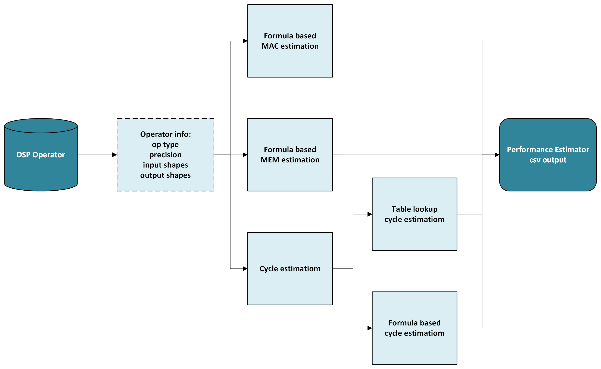

== Performance Estimator

=== Introduction
---
Performance Estimator (PE) is a tool for quickly predicting the
performance of ONNX models in terms of *MACs* (Multiply-Accumulate
Operations) and *cycles*.

=== PE Usage
---
==== Set variables

`+$ export TVM_RCAR_ESTIMATOR=1+` - If you want to use the estimator

==== Output path of results

The results for CNN-IP and DSP are output in separate files. +
To get an estimated result for the whole model, sum the values for each
file.

* CNN-IP +
`+tvmgen_default_<relay name>/RenesasGenProfiler.xls+`
* DSP +
Default ("`save_artifacts`" to be specified at compile time) +
`+<save_artifacts>/dsp_profiler_<number of date>.csv+` +
If "`RCAR_IMP_DIR`" is set, like "`export RCAR_IMP_DIR=mylog`", then +
`+${RCAR_IMP_DIR}/dsp_profiler_<date>.csv+`

=== Functions Description
---
* MACs estimation

** Generally we ported the ONNX-Tool to calculate MACs as an initial step,
and made tests to ensure that the same results are output.

* Cycles estimation

** Formula based +
We can dump the DKL SSP kernel assembler code and LSU0+LSU1+VPU0+LVPU
cycles table for cycles estimation, we created python formula based on
the LSU0+LSU1+VPU0+LVPU cycles table to calculate the pure cycles of the
DSP SSP kernel, and calculate DMA cycles by using total tensor shape and
bytes-per-cycles calculated by AXI size, 1st access latency, middle
access latency.
** Table look up +
We can record the HIL profiles of a certain op with different input
shape, parameters, then when we got a new case we can find the nearest
record and use it for reference.

* MEMs estimation

** Calculate memory consumption for DSP ops, the results will be dumped in
dsp_estimator.csv and displayed in profiler.

