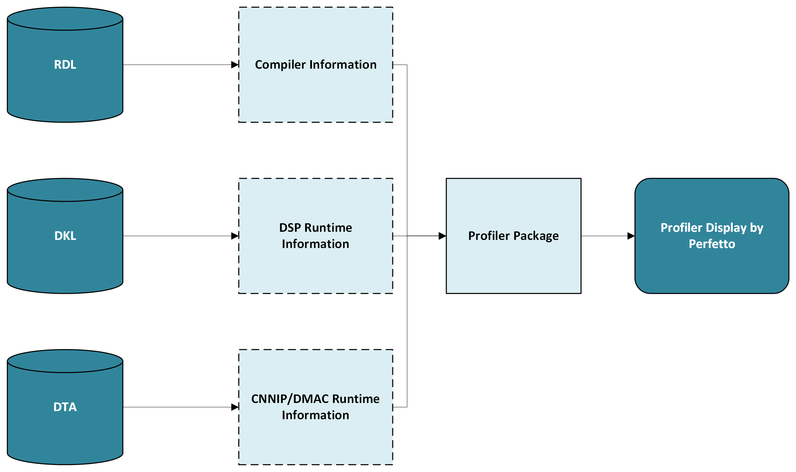
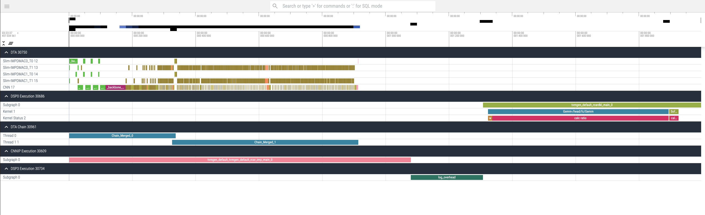

== HyCo Profiler Tool RPerf User Guide

=== Introduction
---

HyCo Profiler Tool `+RPerf+` is a performance profiling tool
designed to analyze the execution of neural networks running on R-Car
board accelerators. `+RPerf+` provides comprehensive insights into
performance metrics, enabling the identification of potential
bottlenecks in the accelerator hardware and software stack.

=== Profiler Environment Configuration Description
---
* Environment Variables +
TVM requires certain environment variables to generate inputs for rperf.

[.text-center]
[cols="^,^,^",options="header"]
|===
|Name |Active Value |Host/Board
|TVM_RCAR_DSP_LOG |1 |Board
|TVM_RCAR_LOG_EXECUTE_TIME |1 |Board
|TVM_RCAR_PROFILE |1 |Host
|TVM_RCAR_PROFILE_DIR |Absolute path |Host/Board
|RCAR_IMP_DIR |Absolute path |Host
|===

* Profile Levels +
Use different options to profile at different granularity.

[.text-center]
[width="99%",cols="^5%,^30%,^38%,^1%,^26%",options="header",align="center"]
|===
|Level |Host |Board |DTA |Profile Granularity
|0 |None |TVM_RCAR_PROFILE_DIR, TVM_RCAR_LOG_EXECUTE_TIME |N |Subgraphs
per device

|1 |TVM_RCAR_PROFILE |TVM_RCAR_PROFILE_DIR, TVM_RCAR_LOG_EXECUTE_TIME,
TVM_RCAR_DSP_LOG |N |Subgraphs per device, DSP OPs

|2 |TVM_RCAR_PROFILE, TVM_RCAR_PROFILE_DIR |Same as above |N |Subgraphs
per device, ONNX mapping of DSP OPs

|3 |TVM_RCAR_PROFILE, TVM_RCAR_PROFILE_DIR, RCAR_IMP_DIR |Same as above
|Y |Subgraphs per device, CNNIP OPs & ONNX mapping
|===

=== RPerf Usage
---
Under different profile levels, different logs will be generated, copy
them to the same path, and run rperf

[source,bash]
----
usage: rperf [-h] [-i INPUT_DIR] [-o OUTPUT_JSON] [-s] [-v]

options:
    -h,             --help                     show this help message and exit
    -i INPUT_DIR,   --input_dir   INPUT_DIR    profile input directory path
    -o OUTPUT_JSON, --output_json OUTPUT_JSON  output trace json file path(default output.json)
    -s,             --stats                    statistical analysis
    -v,             --version                  the version of rperf tools
----

The result `+trace.json+` can be viewed by performance visualizer UI
such as https://ui.perfetto.dev/[Perfetto].

.Perfetto

=== Features Description
---
Among the various traces and information displayed, the following are
particularly relevant for understanding the execution behavior and
optimization opportunities.

* `+CNNIP Execution+`: This trace represents the total execution time
spent by the CNNIP hardware accelerator on neural network operations. It
provides a high-level overview of the CNNIP’s computational performance
and efficiency outside the CNNIP devices.
* `+DSP Execution+`: Similar to the CNNIP execution trace, this trace
visualizes the execution timeline of models running on the DSP (Digital
Signal Processor) device. It highlights operations specific to the DSP,
such as GEMM (General Matrix Multiplication) operations, which are
commonly used in neural network computations. Analyzing the DSP
execution trace can aid in understanding the performance characteristics
of the DSP and identifying potential optimization opportunities.
* `+DTA+`: This trace displays the execution time collected by DTA. It
provides insights into the specific operations performed by the CNNIP
accelerator, including memory operations, mathematical computations such
as convolution operations, and other related tasks. Analyzing this trace
can help identify potential bottlenecks or areas for optimization within
the CNNIP hardware.
* `+DTA Chain+`: The CNNIP chaining information provides insights into
the chaining mechanism employed by the CNNIP device. A chain refers to a
sequence of operations executed solely utilizing the dedicated memory for
CNNIP, without utilizing the `+Slim-DMAC+` (Direct Memory Access
Controller) to communicate with system memory for efficient data
transfer. Chaining is a performance optimization technique that reduces
the overhead associated with data transfer between the CNNIP and the
main memory (DDR). By analyzing the chaining information, developers can
understand how effectively the chaining mechanism is being utilized and
identify potential areas for further optimization to improve overall
model inference performance.

* CNNIP execution trace

** `+subgraph+`: This component represents the execution of a specific
sub-function within the TVM Relay IR on the CNNIP hardware accelerator.

* DSP execution trace

** `+subgraph+`: This component represents the execution of a specific
sub-function within the TVM Relay IR on the DSP hardware accelerator.
** `+kernel+`: This component corresponds to the execution of a
particular kernel or operation on the DSP, such as `+SoftMax+`.
** `+kernel status+`:
*** `+calc ratio+`: This component represents the ratio of computing time
on the DSP. It corresponds to the time spent executing various
operations, such as matrix multiplications (e.g., GEMM) or other
numerical calculations, as part of the neural network model’s execution
on the DSP hardware accelerator.
*** `+wait ratio+`: This component represents the ratio of pure wait time
on the DSP. It may include waiting for data transfers between the system
memory (DDR) and the DSP’s local memory, or any other I/O-related
operations that introduce latency in the overall execution pipeline. It
does not include the wait time which is hidden by computation.

* DTA Trace

** `+Slim-IMPDMAC0_T0+`: This trace represents the transfer of data (like
feature map, weights) from the main memory (DDR) to the CNNIP. It
reflects the overhead associated with loading data from external storage
to the accelerator.
** `+Slim-IMPDMAC1_T0+`: This trace represents the transfer of data (like
feature map, weights) from the CNNIP to the main memory, utilizing the
second channel. It reflects the overhead of writing computed results
back to external storage.
** `+Slim-IMPDMAC0_T1+`: This trace represents the transfer of data (like
feature map, weights) from the main memory to the CNNIP. Weights are a
core component of neural network models and need to be loaded into the
accelerator for computation.
** `+Slim-IMPDMAC1_T1+`: This trace represents the transfer of data (like
feature map, weights) from the CNNIP to the main memory, utilizing the
second channel.
** `+CNN+`: This trace directly reflects the time spent by the CNNIP
hardware accelerator executing neural network operations, such as
convolution computations. Analyzing this trace helps evaluate the
computational performance of the CNNIP.

*  DTA Chaining information

** `+Threads+`: The threads associated with the CNNIP execution trace,
reflecting the parallel execution of neural network operations across
multiple threads.

* Detailed information display

** `+name+`: The name of the operation or trace event, reflecting the
specific task or computation being performed.
** `+Start Time+`: The timestamp indicating when the operation or trace
event began execution.
** `+Duration+`: The time taken to complete the operation or trace event,
representing the overall execution time.
** `+Thread ID+`: The unique identifier of the thread associated with the
operation or trace event.
** `+Process ID+`: The unique identifier of the process associated with
the operation or trace event.
** `+MACs+`: Theoretical MACs for operators. In particular, MACs for DSP LUT
ops are calculated based on DSP lookup table function.
** `+RelayFunction+`: Indicates the RelayIR subgraph that the operator
belongs to in TVM Compiler.
** `+tiles+`: associated with the CNNIP execution trace represent the
minimum execution unit or granularity of an operator.
** `+MEMs in Bytes+`: Theoretical memory consumption for operators,
calculated based on input/output shape and precision.

