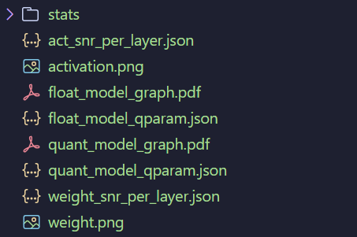
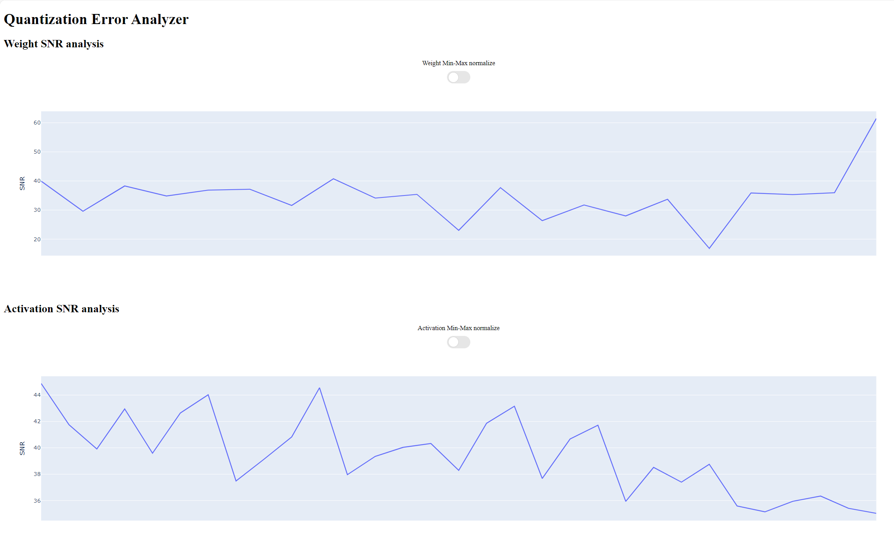
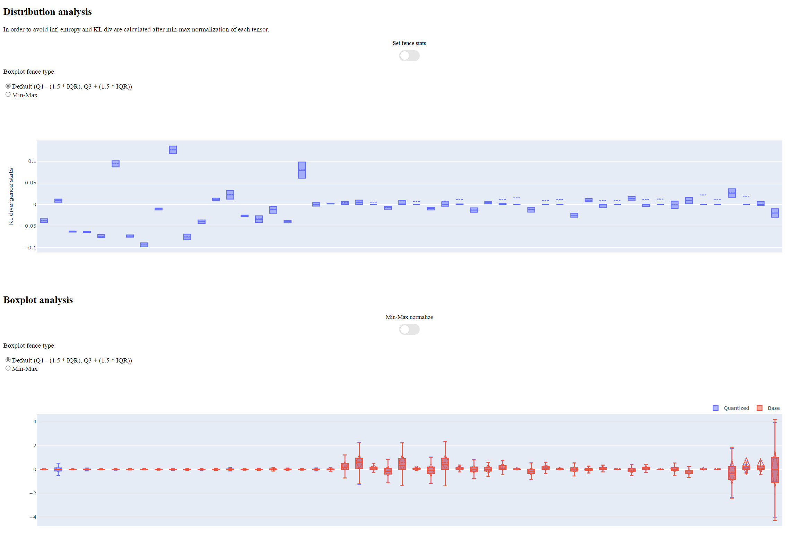
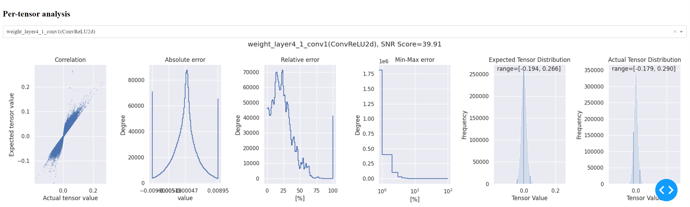

=== SNR Analyze tool

The SNR Analyze tool is developed based on PyTorch numeric suite, and is provided in `rcar_qat_quantizer` to analyze the differences between a floating-point (FP32) model and its quantized version. 
It provides detailed statistics and visualizations to help developers understand the impact of quantization on model weights and activations. This document provides a comprehensive guide to using and understanding the functionality of the tool:

* Compare weights and activations between FP32 and quantized models.
* Calculate Signal-to-Noise Ratio (SNR) to measure the similarity between original and quantized values.
* Export results in JSON or PTH format for further analysis.
* Visualize weight and activation comparisons using plots.
* Dump FX graphs for model visualization.

Belows are some API examples:

. `analyze_model`: The `analyze_model` function is the main entry point for analyzing the differences between two models.

[source, python]
----
from rcar_qat_quantizer.analyze import analyze_model
analyze_model(
  model_fp32, # The floating-point (FP32) model to be compared.
  model_quant, # The quantized model to be compared.
  example_inputs, # example inputs used to obtain activations from both models.
  export_dir, # directory to export analyze result
  dump_graph = True, # A boolean flag to indicate whether to dump the FX graph of the models (default is False).
  comparison_fn = get_snr(), # An optional function to calculate the comparison metric (set to PSNR if not provided).
  comparison_name = "snr", # The name of the comparison metric. (set to "snr" if not provided)
  op_to_type_to_weight_extraction_fn = None, # An optional dictionary to override the PyTorch weight extraction functions. (default is None)
  export_format = "json", # The format in which to export the results (default is "json").
  num_jobs = 5, # The number of jobs to use for parallel processing (default is 5).
)
----

After the function call, following files are exported to the specified `export_dir`:

*** `weight.png`: A plot showing the SNR of weights per layer.
*** `activation.png`: A plot showing the SNR of activations per layer.
*** `weight_snr_per_layer.{export_format}`: A file containing the SNR of weights per layer in the specified format.
*** `act_snr_per_layer.{export_format}`: A file containing the SNR of activations per layer in the specified format.
*** `float_model_qparam.{export_format}`: A file containing the quantization parameters of the FP32 model.
*** `quant_model_qparam.{export_format}`: A file containing the quantization parameters of the quantized model.
*** `float_model_graph.pdf`: The FX graph for float model. Only exports when `dump_graph` set to True.
*** `quant_model_graph.pdf`: The FX graph for quantized model. Only exports when `dump_graph` set to True.
*** `stats`: the folder containing comparison results for all layers. Use `scripts/view.py` script to visualize it.

A script `view.py` under `rcar_qat_quantizer/scripts/` is provided to help user to visualize the exported data. Before using the script, please make sure the dependency is installed:

[source, bash]
----
pip install -r scripts/requirements.txt
----

Then use following command to generate interactive UI to visualize result, where `export_dir` is the directory used in `analyze_model`:

[source, bash]
----
python scripts/view.py -i export_dir/stats
----

The script will print message like `Dash is running on http://0.0.0.0:8050/` in terminal. Open that url in web browser to visualize the result. The interactive UI contains following parts:

* SNR analysis for weight and activation

* distribution analysis

* per tensor analysis

[start=2]
. Comparison Functions

`compare_weight` is provided to analyze the weight error between float model and quantized model. It supports customized comparison function and uses `psnr` to compare weight if omitted.

[source, python]
----
from rcar_qat_quantizer.analyze import compare_weight
result = compare_weight(
  model_a, # model a to compare
  model_b, # model b to compare
  comparison_fn = get_snr(), # An optional function to calculate the comparison metric (set to PSNR if not provided).
  comparison_name = "snr", # The name of the comparison metric. (set to "snr" if not provided)
  base_name_to_sets_of_related_ops = None, # An optional dictionary to override subgraph base nodes. (default is None)
  op_to_type_to_weight_extraction_fn = None, # An optional dictionary to override the PyTorch weight extraction functions. (default is None)
)
----

`compare_activation` is provided to analyze the activation error of each layer. Users must provide example_inputs to generate the necessary activations for comparison

[source, python]
----
from rcar_qat_quantizer.analyze import compare_activation
result = compare_activation(
  model_a, # model a to compare
  model_b, # model b to compare
  example_inputs, # example inputs
  comparison_fn = get_snr(), # An optional function to calculate the comparison metric (set to PSNR if not provided).
  comparison_name = "snr", # The name of the comparison metric. (set to "snr" if not provided)
)
----

