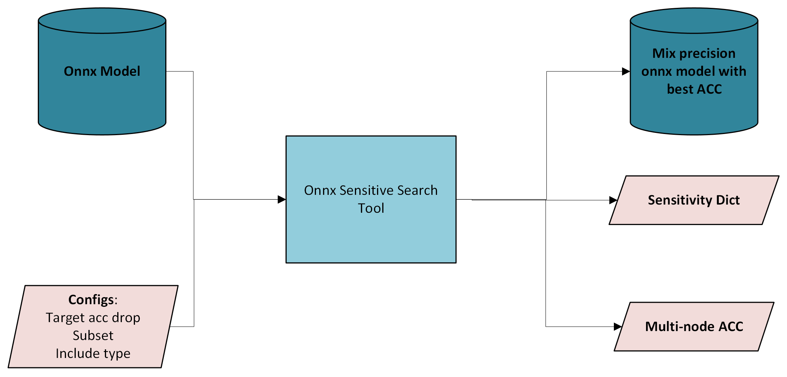

== Renesas ONNX Sensitive Search Tool User Guide

=== Introduction to ONNX Sensitive Search Tool

ONNX Sensitive search tool helps user get a mixed-precision model to
achieve given accuracy while keeping as many INT8 layers as possible
to provide a relatively good performance.

Currently this feature is only supported for open source models in
REACTION, for BYOM models this feature is not supported yet.

=== Features

[arabic]
. Support customized search configurations: acc_drop, subset.
. Support customized target nodes: include & exclude type.
. Support config searching for multiple FP32 layers.
. Support early_stop & timeout to balance accuracy and time cost
. It retains the model configuration which achieves the best ACC while having the least
FP32 nodes during the search.
. If the target is impossible to achieve within the given timeout limit or
target nodes, it will return the best model.

=== Example of onnx_sensitive_search for ONNX PTQ

[source,yaml]
----
experiment:
  name: ResNet50
  model_name: ResNet50
  task: quant_onnx
  action: opt
  optimize_configs:
    method: sensitive_search
    sensitive_search:
      acc_drop: 0.2
      subset: 1000
      include_type:
      exclude_type: ["Conv", "MatMul","DequantizeLinear", "QuantizeLinear"]
      early_stop: true
      timeout: 300
  line: onnx
----

=== Outputs of sensitive_search

ONNX Sensitive search tool will save results in work_dir/\{experiment_name}/quant/, the search logs can be found in conversion.log, other outputs are: 

. best_mix_model.onnx: Model with the best accuracy and mix config.
. sensitivity.json: Sensitivity dictionary of the model.
. multi_node_acc.json: Accuracy results for multiple FP32 nodes.
