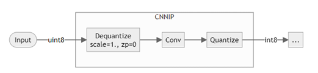

== Performance Optimization Tips

This section is a guide for further optimizations to improve latency on V4x devices. Some optimization algorithms/techniques supported by quantizer and compiler are introduced.

- - -

=== Quantization

This section introduces optimization algorithms supported by quantizer.

==== R-Car ORT Quantizer

[disc]
* **uint8 input**

Quantizer can delete the first Quantize processing which is performed by DSP if input data format is uint8 to improve performance. Unsigned integers in 8 bits are commonly used, and hardware like ISP uses them as its raw memory format (RGB-888). So, supporting direct inputs as uint8 can improve performance by reducing unnecessary processing of the data.

The uint8 format is supported with limited support:

[circle]
* Support only the input of "Conv" in the case where there is a "Conv" immediately after the input.
* Image input with values [0-255].

Reaction can support the InsertPreprocess or MergeNormToConv2d option and run with uint8 input with following options in reaction.yaml file:
[source,yaml]
----
model_configs:
  data_preprocessor:
    mean: [92.34, 92.91, 91.84]
    std: [32.23, 31.34, 31.06]
    totensor: false
    permute: false
convert_configs:
  quantization:
    insert_preprocess: "input"
----
[source,yaml]
----
model_configs:
  data_preprocessor:
    mean: [92.34, 92.91, 91.84]
    std: [32.23, 31.34, 31.06]
    totensor: false
    permute: false
convert_configs:
  quantization:
    merge_preprocess: "input"
----

With this command, quantizer will delete Quantize operator after the input layer.

[circle]
* By inputting [0-255] image, input data in uint8 (scale=1., zp=0) format, the quantization process immediately after the input layer that existed in the past is skipped.
* Conventionally, this quantization process is handled by the DSP. This option eliminates that step.
* When the mean and std are given in the normalized form (divided by 255), we need to set "totensor" to true.
* If "permutation" is true, it reverses the order of the channel. It is used for BGR -> RGB and RGB -> BGR conversion.

Following figure shows the uint8 QDQ model generated by quantizer:

- - -

=== TVM

==== Dispatching and how to read Relay IR

TVM Compilation generates artifacts in the following directory work_dir/exp_name/tvm_, which contains the generated CNNIP subgraphs, DSP code and DSP ELF file, along with a few other informative files. In particular, Intermediate Representation (Relay IR) can show how the model is represented in TVM and can be used to confirm the partitioning of the model into DSP and CNNIP. It can be found in work_dir/exp_name/tvm_cdh(cch or cpu)/tvm_model_relay.txt.

Relay uses function (e.g. fn(%x)) to represent the graph. To achieve better performance, the model is dispatched as extensively as possible on CNNIP.

[disc]
* **Dispatch to R-Car CNNIP**

The operators in @tvmgen_default_tvmgen_default_rcar_imp_main_xxx are executed by CNNIP, and in this case `Compiler="rcar_imp"` in the partition attributes.

The following shows part of Relay of example model on CNNIP:
----
def @tvmgen_default_tvmgen_default_rcar_imp_main_0(%rcar_imp_0_i0: Tensor[(1, 3, 224, 224), int8] /* ty=Tensor[(1, 3, 224, 224), int8] */, Compiler="rcar_imp", Primitive=1, Inline=1, global_symbol="tvmgen_default_tvmgen_default_rcar_imp_main_0") -> Tensor[(1, 1000, 1, 1), int8] {
  %63 = fn (%FunctionVar_20_0: Tensor[(1, 3, 224, 224), int8] /* ty=Tensor[(1, 3, 224, 224), int8] */, PartitionedFromPattern="qnn.conv2d_nn.bias_add_qnn.requantize_maximum_", Composite="rcar_imp.qnn_conv2d.nn_bias_add.nn_relu.clip.qnn_leaky_relu.qnn_sigmoid.qnn_tanh") -> Tensor[(1, 64, 112, 112), int8] {
…
----

[disc]
* **Dispatch to R-Car DSP**

The operators in @tvmgen_default_rcar_main_xxx are executed by DSP. In this case, `Compiler="rcar"` in the partition attributes.

The following shows part of Relay of example model on DSP:
----
def @tvmgen_default_rcar_main_0(%rcar_0_i0: Tensor[(1, 3, 224, 224), float32] /* ty=Tensor[(1, 3, 224, 224), float32] */, Compiler="rcar", Primitive=1, Inline=1, global_symbol="tvmgen_default_rcar_main_0") -> Tensor[(1, 3, 224, 224), int8] {
  qnn.quantize(%rcar_0_i0, 0.0186584f /* ty=float32 span=input_QuantizeLinear.input_scale:0:0 */, -14 /* ty=int32 span=input_QuantizeLinear:0:0 */, out_dtype="int8", axis=1) /* ty=Tensor[(1, 3, 224, 224), int8] span=input_QuantizeLinear:0:0 */
}
----

==== CNNIP

[disc]
* **RenesasUserConfig.json**

RenesasUserConfig.json is provided to control the CNNIP optimization parameters for latency optimization. There are 5 main items to optimize CNNIP latency with RenesasUserConfig.json:

1. Set the recommended values for the options below:
[circle]
* LARGE_KERNEL_FAST_MODE=false
* ENABLE_V4H2_CNNIP_DMAI_MAGNIFICATION_WORKAROUND=false
* OPTIMIZATION_WITH_NO_DSP_LAYER=true
* ENABLE_DMAC_MULTITHREADING=true
* ENABLE_MEMORY_REUSE_OF_TUNNEL_INOUT_FEATURE_MAP=true
* REORDERING_DRAM_OUTPUT_LAYERS=true

2. If latency is slow with the above config, change: "BRANCH_TUNNELING_ALGORITHM=DP", "GENERATION_TIME_TOLERANCE_LEVEL=5", "DECIDE_MERGED_CHAIN_LAYER_LIMIT_INTERNALLY=true". This setting may take a long time to compile. If the compile time is unacceptable, try the following setting: (If the total size of the input and output FeatureMaps exceeds 2MB per layer, it is considered large.)
[circle]
* If there are many layers with small FeatureMap: "ALLOW_LONG_NONDIVISION_MERGED_CHAIN=true" and "MERGED_CHAIN_LAYER_LIMIT_FOR_NONDIVISION=100"(Set a value larger than MERGED_CHAIN_LAYER_LIMIT based on the number of layers in your network)
* If there are many layers with large FeatureMap: "MAX_TIMES_TRY_DIVISION_BRANCH_TUNNELING=30" or "REDUCE_TILING_OVERLAP=true", or both
* If FeatureMap sizes are extremely large such as 2K or 4K: "TILING_MODE_STRIPE=false"

3. CNNIP is most efficient when the FeatureMap width is a multiple of 16. If your network have a part that consists only of layers other than convolution, try replacing it with an equivalent calculation layer so that it can be processed by a FeatureMap whose width is a multiple of 16. If the latency is still slow and your network includes a corresponding layer, try the options below:
[circle]
* RELIEVE_PACKED_FORMAT_FOR_MULTIPLE_INPUT_LAYER=true (When the number of channels in the input featureMap for Eltwise Sum, Eltwise Mul or Concat(axis=1) is 16 or less)
* USE_DMAI_PLANAR_TYPE=true (When the width of the input FeatureMap in the CNNIP part of the network is not a multiple of 16)
* SMALL_CONCAT_SLOW_MODE=true (When the number of channels in each input FeatureMap of Concat(axis=1) is 8 or less for a combination of Concat(axis=1) and layers other than convolution, such as activation and pooling)
* ELTWISE_SUM_1PASS_MODE=true (when model has Eltwise Sum)
* OPTIMIZE_CONCAT_WITH_WRAP_AROUND=true (Combination of Concat(axis=1) and 1x1 convolution)

4. If the performance estimator value is slower than the actual measured value, set MEMORY_BANDWIDTH to a larger value such as 20.

5. If weight transfer is the bottleneck in the DTA, set a larger value to WEIGHT_BANK_SIZE. Or consider batch processing if possible.

[disc]
* **Multi Batch**

convert\tvm\onnx2tvm.py can support the multi-batch. The user needs to set the batch size in the reaction.yaml file to enable the function. Following shows reaction.yaml sample to enable the function:
[source,yaml]
----
experiment:
  model_name: xxx
  target: v4h2
  …
  convert_configs
  …
  tvm:
    cnnip_batch_size: 1
    host: xxx
    port: xxx
----

==== DSP

* **Remove int64 Cast processing when Argmax (<=32) dispatched to CNNIP**

From ONNX specification, the output of Argmax is index in int64. TVM will cast output of Argmax to int64. To skip the processing and output int8, add following commands in convert\tvm\onnx2tvm.py:

[source,python]
----
from tvm.relay.op.contrib.rcar_imp import partition_for_rcar_imp,insert_argmax_cast,remove_argmax_dequantize from tvm.relay.op.contrib.rcardkl import partition_for_rcardkl,RemoveInputOutputQDQ

mod = insert_argmax_cast(remove_argmax_dequantize(mod), "int8")         
mod = RemoveInputOutputQDQ(remove_cast=True, remove_quantize=False, remove_dequantize=False)(mod)
----

- - -

=== Profiler

HyCo provides profiler to show HIL runtime of CNNIP and DSP operators. Details refer to Debugging and Profiling Tools part of this document.

- - -

=== Runtime Application

REACTION supports standalone runtime applications for 6 common models. These standalone applications support multithread and multicore thereby increasing the throughput of the model.
