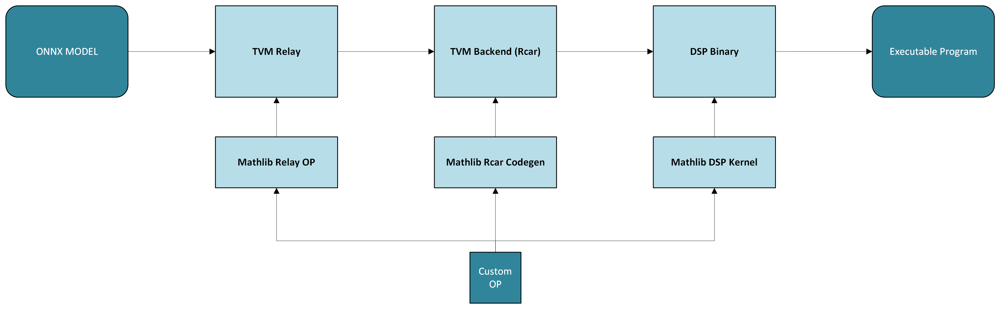

== Renesas Hybrid Compiler Math Library User Guide

=== Introduction
---
`+MathLib+`, the Renesas Hybrid Compiler Math Library, is an advanced
software package that offers a comprehensive range of mathematical
functions and operations. Designed with a focus on simplicity and
performance. This approach ensures that developers can quickly and
easily integrate advanced mathematical operations into their TVM
workflows, thus streamlining the development process and boosting
overall productivity.

=== Run TVM model with MathLib Custom Patterns
---

* Declare the following environment variables on the host machine.
[source,bash]
----
export LD_PRELOAD="/path_to/your_own_project/build_codegen/libcodegen.so"
export MATHLIB_DIR="/path_to/your_own_project/lib_dsp"
----

*  Add your custom patterns to the TVM model before the partition_for_rcardkl and after partition_for_rcar_imp passes. +
Here's a sample script to integrate and run custom patterns with TVM:

[source,python]
----
def load_onnx(input_model_path):
    onnx_model = onnx.load(input_model_path)
    mod, params = relay.frontend.from_onnx(onnx_model)
    return mod, params

def add_pattern(data=wildcard(), data1=wildcard()):
    scale0=is_constant()
    zero_point0=is_constant()
    scale_1=is_constant()
    zero_point_1=is_constant()
    out_scale=is_constant()
    out_zero_point=is_constant()

    add = is_op('qnn.add')(data, data1, scale0, zero_point0, scale_1, zero_point_1, out_scale, out_zero_point)

    return add

@tvm.relay.op.contrib.register_pattern_table("rcar")
def _pattern_table(include_reshape_ops: bool = False):
    return [
        ("rcar.dkl.mathlib.add", add_pattern())
    ]

def compile_and_export_relay_model(relay_ir_mod,
                                   module_path, llvm_target,
                                   dkl_target,
                                   custom_patterns=None):
    if custom_patterns is None:
        custom_patterns = []
    with tvm.transform.PassContext(opt_level=3):
        mod = relay.transform.FakeQuantizationToInteger()(relay_ir_mod)
        # Note that: please add your custom pattern before the
        # Note that: `partition_for_rcardkl` and `partition_for_rcar_imp`
        mod = partition_for_rcar_imp(mod)
        mod = relay.transform.MergeComposite(custom_patterns)(mod)
        mod = partition_for_rcardkl(mod)
        lib = relay.build(mod, target=[llvm_target, dkl_target])

    lib.export_library(module_path)

def run_model_with_rpc(module_path, ip, port):
    # runtime
    remote = rpc.connect(ip, int(port))
    remote.upload(module_path)
    rlib = remote.load_module(module_path)
    rdev = remote.cpu()

    graph_mod = graph_executor.GraphModule(rlib["default"](rdev))
    graph_mod.run()
----

=== Building MathLib with User Defined Custom Kernels
---

* Naming Conventions for Function Development

** `+MathLib Kernel Functions+`: Use CamelCase for naming the actual
functions within the MathLib kernel. For instance, a function should be
named `+MathlibKernelFunction+`. 

* Implementing Kernel Functions by Inheriting Struct

** Create a new struct that inherits from the
mathlib::codegen::codegen_interface.

** Implement Required Functions

*** `+init_call_node+`

*** `+UseLut+`

*** `+InferTemplateTypes+`

*** `+InferAttributes+`

*** `+InferArgsAndRegisterCandidates+`

* Register Your Kernel +
** Ensure your kernel is registered in the unordered map `+creators+` at `+src/codegen/codegen_factory.cc:16+`

* Adding DSP Kernel Profile Probes

** Modify the `+RcardklOperatorId+` enum located in the `+include/mathlib/kernel/r_rcardkl_mathlib_operator_id.h+` file by adding a unique operator ID for your custom DSP kernel. 

* Add your code in the `+/workspace/mathlib+` directory

** `+include/mathlib/codegen/codegen_xxx.h+`: The your kernel header file
for code generation.
** `+include/mathlib/kernel/mathlib_xxx.h+`: The your kernel header file
for DSP kernel implementation.
** `+src/codegen/codegen_xxx.cc+`: The your kernel codegen interface
implementation for code generation.
** `+src/kernel/mathlib_xxx.cc+`: The your kernel implementation for DSP
kernel.

* Rebuild MathLib

** Once you’ve added your code, rebuild `+MathLib+` to generate the updated
`+libcodegen.so+` and `+lib_dsp+`.

** After compilation, the new `+libcodegen.so+` and `+lib_dsp+` will be
available in the `+build_codegen+` and `+lib_dsp+` directories.
