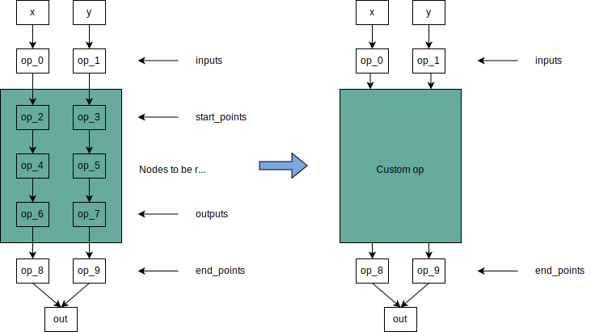

= Custom Node Replacement in TVM Relay

The JSON node replacement functionality can be used to replace a part of the Relay graph with a custom operator implementation. The steps to achieve this are as follows:

1. Describe the node replacement parameters in a JSON file. For this example, we'll assume it's called `test.json`.
2. Run the node replacement pass on the Relay module:
+
[source,python]
----
# Some Relay passes...
mod = ReplaceNodesPass("test.json")(mod)
# More Relay passes...
----

== Structure of the JSON file
The JSON file allows specifying multiple custom op replacements to be performed in a single pass.

[source,json]
----
{
  "replace_nodes": [
    <custom_op_1>,
    <custom_op_2>,
    ...
  ]
}
----

Each of the items above (`<custom_op_1>` etc.) has the following structure:

[source,json]
----
{
  "inputs": ["In_0", "In_1"],
  "start_points": ["Start_0", "Start_1"],
  "custom_op_name": "DetectionOutput",
  "custom_const": {"value": [5000, 200, 30, 0.5, 0.25]},
  "outputs": ["Out_0", "Out_1"],
  "end_points": ["End_0", "End_1"],
}
----

The meanings of the various fields are described for the following example model:

* `inputs`: Nodes that serve as the inputs of the custom op. This should match the number (and order) of inputs of the custom node.
* `start_points`: Nodes that mark the beginning of the region to be replaced.
* `outputs`: Nodes that mark the end of the region that is to be replaced.
* `end_points`: Nodes that are going to consume the outputs of the custom op. This should match the number (and order) of outputs of the custom node.
* `custom_op_name`: Name of the custom op.
* `custom_const`: This has a single field `value` which describes the attributes of the custom op.

Note:
1. If `outputs` and `end_points` are omitted, then the region to be replaced is from `start_points` to the end of the graph.
2. If `custom_op_name` and `custom_const` are omitted, then the region isn't replaced by anything; it's simply deleted.
