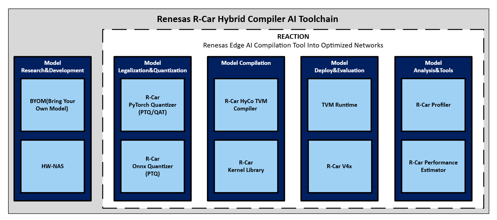

# Renesas AI Solution Toolkit: R-Car Hybrid Compiler

Renesas provides a comprehensive solution toolkit to optimize and accelerate Neural Network deployment on R-Car SoC devices for AD/ADAS.

Renesas' AI solution toolkit includes the following components:

## Model Research & Development

- ### R-Car HW-NAS

R-Car HW-NAS generates deep learning network models that efficiently utilize the HWA, DSP, and memory in R-Car. This enables early development of lightweight network models that achieve requirements of the recognition accuracy and processing time without requiring in-depth knowledge of R-Car.

## Model Legalization & Quantization

- ### R-Car ONNX Quantizer

R-Car ONNX Quantizer is a tool to quantize ONNX models into an executable format for R-Car HyCo.

- ### R-Car PyTorch Quantizer

R-Car PyTorch Quantizer is a tool to quantize PyTorch models into an executable format for R-Car HyCo.

## Model Compilation

- ### R-Car Hybrid Compiler (HyCo)

R-Car Hybrid Compiler (HyCo) uses OSS TVM as a common backbone with extended functionality in the front-end. It integrates TVM with back-end designs specific to each SoC, enabling developers to reuse the same tools across hardware generations.

- ### R-Car Kernel Library

Kernel libraries for HW-Accelerators (Renesas Device Library) and DSP (DSP Kernel Library and MathLib) are provided.

## Model Analysis & Tools

- ### Profiler

This tool is designed to analyze the execution of neural networks running on R-Car board accelerators.

- ### Performance Estimator

This tool is designed to predict the performance of ONNX models in terms of *MACs* (Multiply-Accumulate Operations) and *cycles*.

# R-Car Hybrid Compiler Index

 - [Introduction](01_Introduction/introduction.adoc)
 - [Architecture Overview](02_ArchitectureOverview/01_index.adoc)
   - [High-Level Architecture](02_ArchitectureOverview/02_high-level_architecture.adoc)
   - [Supported Devices](02_ArchitectureOverview/03_supported_devices.adoc)
   - [Exhaustive execution types and flow](02_ArchitectureOverview/04_detailed_execution_flow.adoc)
 - [Tutorials](03_Tutorials/Tutorials.adoc)
 - [Tools](04_Tools/Tools.adoc)
   - [V4H-NAS](04_Tools/01_V4H-NAS/01_index.adoc)
     - [Overview](04_Tools/01_V4H-NAS/02_overview.adoc)
     - [Quick Start](04_Tools/01_V4H-NAS/03_quick_start.adoc)
   - [X5H-NAS](04_Tools/02_X5H-NAS/01_index.adoc)
     - [Overview](04_Tools/02_X5H-NAS/02_overview.adoc)
     - [Quick Start](04_Tools/02_X5H-NAS/03_quick_start.md)
   - [R-Car ORT Quantizer](04_Tools/03_RCarOrtQuantizer/index.adoc)
     - [Overview](04_Tools/03_RCarOrtQuantizer/overview.adoc)
     - [Preprocess](04_Tools/03_RCarOrtQuantizer/01_preprocess/preprocess.adoc)
     - [Calibration](04_Tools/03_RCarOrtQuantizer/02_calibration/calibration.adoc)
     - [Customization](04_Tools/03_RCarOrtQuantizer/03_customization/customization.adoc)
     - [Quantization](04_Tools/03_RCarOrtQuantizer/04_quantization/quantization.adoc)
     - [Extra options](04_Tools/03_RCarOrtQuantizer/05_extra_options/extra_options.adoc)
     - [R-Car ORT Quantizer for TVM](04_Tools/03_RCarOrtQuantizer/06_rcar_ort_quantizer_for_tvm/rcar_ort_quantizer_for_tvm.adoc)
   - [R-Car Pytorch Quantizer](04_Tools/04_RCarQatQuantizer/RCarQatQuantizer.adoc)
   - [TVM](04_Tools/05_TVM/01_index.adoc)
     - [DKL Codegen Backend](04_Tools/05_TVM/02_dkl-codegen.adoc)
     - [R-Car IMP Codegen Backend](04_Tools/05_TVM/03_cnnip-codegen.adoc)
     - [Applying Relay Passes](04_Tools/05_TVM/04_apply-relay-passes.adoc)
     - [Runtime Architecture](04_Tools/05_TVM/05_runtime-architecture.adoc)
     - [Optimizations](04_Tools/05_TVM/Optimizations/index.adoc)
   - [REACTION](04_Tools/06_Reaction/Reaction.adoc)
   - [Debugging and Profiling Tools](04_Tools/07_Debugging_and_Profiling_Tools/01_index.adoc)
     - [PerformanceEstimator](04_Tools/07_Debugging_and_Profiling_Tools/02_PerformanceEstimator.adoc)
     - [Profiler](04_Tools/07_Debugging_and_Profiling_Tools/03_Profiler.adoc)
   - [Utility](04_Tools/08_Utility/01_index.adoc)
     - [Pytorch Accuracy Debug Tool](04_Tools/08_Utility/02_SNR.adoc)
     - [Autotune by Hyperband](04_Tools/08_Utility/03_autotune.adoc)
     - [ONNX sensitivity search tool](04_Tools/08_Utility/04_sensitive_search.adoc)
 - [Operations](05_Operations/01_index.adoc)
   - [Supported Operators](05_Operations/02_supported_operators.adoc)
 - [Detailed Documentation](06_DetailedDocumentation/01_index.adoc)
   - [Performance Optimization Tips](06_DetailedDocumentation/02_performance_optimization_tips.adoc)
 - [Advanced Topics](07_AdvancedTopics/01_index.adoc)
   - [MathLib](07_AdvancedTopics/02_MathLib.adoc)
   - [Custom Node Replacement in TVM Relay](07_AdvancedTopics/03_replace-nodes.adoc)
 - [Glossary](08_Glossary/glossary.adoc)
 - [All Resources](09_AllResources/all_resources.adoc)
 - [Legal Notice](10_LegalNotice/legal_notice.adoc)

## Support

### Enquiries
No issues or merge requests allowed. And if you have any questions, please directly contact to [Renesas Technical Support](https://www.renesas.com/support).